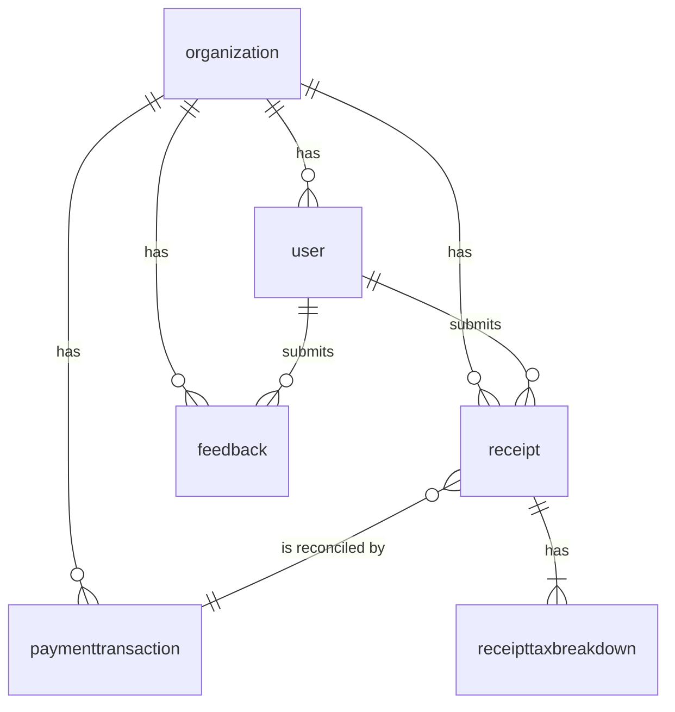

# Database Schema Documentation

## Overview

The GoodStewards application uses **SQLModel** (SQLAlchemy + Pydantic) for database management. SQLModel automatically creates tables based on the model definitions in `app/models/models.py`.

## Table Naming Convention

**SQLModel follows the convention of singular table names:**

| Model Class | Table Name | Description |
|-------------|------------|-------------|
| `Organization` | `organization` | Non-profit organizations |
| `User` | `user` | Users with roles (member/treasurer) |
| `Receipt` | `receipt` | Receipt data with AI-extracted information |
| `ReceiptTaxBreakdown` | `receipttaxbreakdown` | Tax breakdown details |
| `PaymentTransaction` | `paymenttransaction` | Payment reconciliation data |
| `Feedback` | `feedback` | User feedback and support requests |

## Database Schema

### Core Tables

#### `organization`
```sql
CREATE TABLE organization (
    id UUID PRIMARY KEY,
    name VARCHAR NOT NULL,
    fein VARCHAR UNIQUE,
    ntee_code VARCHAR,
    address VARCHAR,
    city VARCHAR,
    state VARCHAR,
    zip_code VARCHAR,
    created_at TIMESTAMPTZ NOT NULL DEFAULT NOW()
);
```

#### `user`
```sql
CREATE TABLE "user" (
    id UUID PRIMARY KEY,
    organization_id UUID NOT NULL REFERENCES organization(id),
    full_name VARCHAR NOT NULL,
    email VARCHAR UNIQUE,
    hashed_password VARCHAR,
    role VARCHAR NOT NULL DEFAULT 'member' CHECK (role IN ('member', 'treasurer')),
    contact_telephone VARCHAR,
    is_special_user BOOLEAN DEFAULT FALSE,
    special_user_type VARCHAR CHECK (special_user_type IN ('anonymous_donor', 'unknown_user', 'one_time_donor')),
    created_at TIMESTAMPTZ NOT NULL DEFAULT NOW()
);
```

#### `receipt`
```sql
CREATE TABLE receipt (
    id UUID PRIMARY KEY,
    user_id UUID NOT NULL REFERENCES "user"(id),
    organization_id UUID NOT NULL REFERENCES organization(id),
    image_url VARCHAR NOT NULL,
    vendor_name VARCHAR,
    purchase_date DATE,
    county VARCHAR,
    subtotal_amount DECIMAL,
    tax_amount DECIMAL,
    total_amount DECIMAL,
    expense_category VARCHAR,
    status VARCHAR NOT NULL DEFAULT 'processing' CHECK (status IN ('processing', 'pending', 'approved', 'rejected', 'paid')),
    is_donation BOOLEAN DEFAULT FALSE,
    payment_method VARCHAR CHECK (payment_method IN ('zelle', 'check', 'other')),
    payment_reference VARCHAR,
    submitted_at TIMESTAMPTZ NOT NULL DEFAULT NOW(),
    approved_at TIMESTAMPTZ
);
```

#### `receipttaxbreakdown`
```sql
CREATE TABLE receipttaxbreakdown (
    id UUID PRIMARY KEY,
    receipt_id UUID NOT NULL REFERENCES receipt(id),
    tax_type VARCHAR NOT NULL CHECK (tax_type IN ('state', 'county', 'transit', 'food')),
    amount DECIMAL NOT NULL
);
```

#### `paymenttransaction`
```sql
CREATE TABLE paymenttransaction (
    id UUID PRIMARY KEY,
    organization_id UUID NOT NULL REFERENCES organization(id),
    transaction_date DATE NOT NULL,
    amount DECIMAL NOT NULL,
    reference_id VARCHAR,
    receipt_id UUID REFERENCES receipt(id)
);
```

#### `feedback`
```sql
CREATE TABLE feedback (
    id UUID PRIMARY KEY,
    user_id UUID NOT NULL REFERENCES "user"(id),
    organization_id UUID NOT NULL REFERENCES organization(id),
    category VARCHAR NOT NULL CHECK (category IN ('testimony', 'bug_report', 'feature_request')),
    description TEXT NOT NULL,
    device_info VARCHAR, -- JSON as string
    status VARCHAR NOT NULL DEFAULT 'submitted' CHECK (status IN ('submitted', 'in_review', 'resolved')),
    created_at TIMESTAMPTZ NOT NULL DEFAULT NOW()
);
```

## Relationships

### Entity Relationship Diagram



### Foreign Key Relationships

- **Organization → User**: One-to-Many (one organization has many users)
- **Organization → Receipt**: One-to-Many (one organization has many receipts)
- **Organization → PaymentTransaction**: One-to-Many (one organization has many payment transactions)
- **Organization → Feedback**: One-to-Many (one organization has many feedback entries)
- **User → Receipt**: One-to-Many (one user submits many receipts)
- **User → Feedback**: One-to-Many (one user submits many feedback entries)
- **Receipt → PaymentTransaction**: One-to-One (one receipt can be reconciled by one payment transaction)
- **Receipt → ReceiptTaxBreakdown**: One-to-Many (one receipt has many tax breakdowns)

## Important Notes

### Table Name Quoting
When querying the `user` table directly in SQL, you must quote the table name because `user` is a reserved keyword in PostgreSQL:

```sql
-- ✅ Correct
SELECT * FROM "user";

-- ❌ Incorrect (will cause error)
SELECT * FROM user;
```

### SQLModel vs Manual SQL
- **SQLModel**: Automatically creates tables with singular names
- **Manual SQL**: Previously created duplicate tables with plural names (now deprecated)

### Migration Strategy
If you have existing data in plural-named tables (`users`, `receipts`, `organizations`), use the cleanup script:

```bash
python cleanup_duplicate_tables.py
```

## Common Queries

### Get all users for an organization
```sql
SELECT * FROM "user" WHERE organization_id = 'your-org-uuid';
```

### Get all receipts for a user
```sql
SELECT * FROM receipt WHERE user_id = 'your-user-uuid';
```

### Get receipt with tax breakdown
```sql
SELECT r.*, rtb.tax_type, rtb.amount 
FROM receipt r 
LEFT JOIN receipttaxbreakdown rtb ON r.id = rtb.receipt_id 
WHERE r.id = 'your-receipt-uuid';
```

### Get organization statistics
```sql
SELECT 
    o.name,
    COUNT(DISTINCT u.id) as user_count,
    COUNT(r.id) as receipt_count,
    SUM(r.total_amount) as total_receipts
FROM organization o
LEFT JOIN "user" u ON o.id = u.organization_id
LEFT JOIN receipt r ON o.id = r.organization_id
WHERE o.id = 'your-org-uuid'
GROUP BY o.id, o.name;
```

## Development Guidelines

### Creating New Tables
1. Define the model in `app/models/models.py`
2. Use `table=True` parameter
3. Let SQLModel handle table creation automatically
4. Use singular table names

### Database Migrations
- Use Alembic for database migrations
- Never manually create tables with SQL
- Always use SQLModel's `create_all()` for development

### Testing
- Use the test data utilities in `tests/test_data.py`
- Tables are created automatically by SQLModel during tests
- Use singular table names in all test queries 