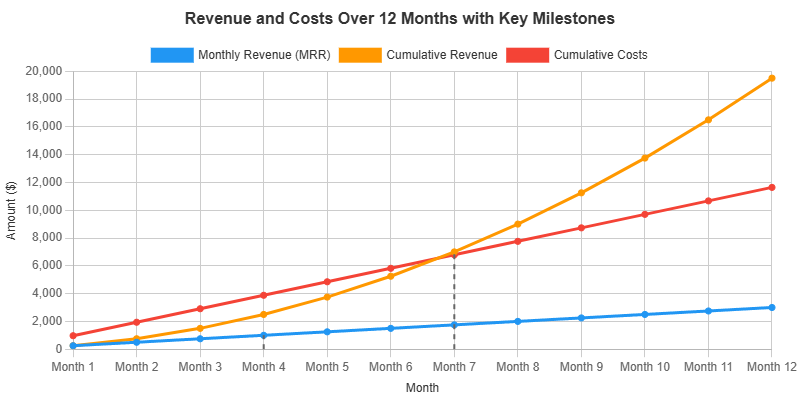

# ROI & Success Metrics

To measure the success of the project and ensure we are delivering value, we will track the following Key Performance Indicators (KPIs).

### Business & Value Metrics

*   **Total Refund Amount Claimed:** The total dollar amount of sales tax refunds successfully claimed by all non-profits on the platform. This is our primary value metric.
*   **Monthly Recurring Revenue (MRR):** Total predictable revenue generated from platform subscriptions.
*   **Customer Acquisition Cost (CAC):** The average cost to acquire a new paying non-profit organization.
*   **Customer Lifetime Value (CLV):** The total revenue a non-profit is expected to generate throughout its time as a customer. CLV > 3x CAC is a healthy target.
*   **Churn Rate:** The percentage of customers who cancel their subscriptions in a given period.

### User Engagement & Adoption Metrics

*   **Adoption Rate:** Percentage of members within a registered non-profit who have activated their account and submitted at least one receipt.
*   **Receipts Processed per Month:** The volume of receipts being processed through the system, indicating active use.
*   **Form Generation Rate:** The number of organizations that successfully generate a Form E-585 each refund cycle.
*   **User Satisfaction (CSAT/NPS):** Regular, simple in-app surveys to gauge treasurer and member satisfaction with the platform.

### Product & Operational Metrics

*   **AI Extraction Accuracy:** The percentage of receipt fields correctly extracted without manual correction by the treasurer.
*   **Average Reimbursement Time:** The average time from when a member submits a receipt to when they receive payment.
*   **Platform Uptime:** The percentage of time the service is available and operational. Target > 99.9%.

---

## Financial Projections

### Cost Projections (Monthly)

| Category | Estimated Cost | Actual Cost | Cost Analysis |
| :--- | :--- | :--- | :--- |
| **Development & Personnel** | | | *Initial personnel costs are zero, assuming sweat equity. Time investment is estimated below.* |
| Technical Lead (Part-Time) | $0 | - | **MVP:** 80 hours (Architecture, setup, core feature oversight) **Post-MVP:** 20 hours/month (Maintenance, planning, code review) |
| Developer (Contract) | $0 | - | **MVP:** 160 hours (Core feature development, frontend/backend build-out) **Post-MVP:** 40 hours/month (New features, bug fixes) |
| **Hosting & Infrastructure** | | | |
| Vercel (Frontend) | $20 | - | Pro tier for advanced features. |
| Render (Backend & DB) | $25 | - | Starter tier for backend services. |
| Cloudflare R2 (Image Storage) | $0 | - | Free tier includes 10GB storage, 1M Class A ops, 10M Class B ops. Costs are very low beyond free tier (e.g., $0.015/GB/month). |
| **Third-Party Services** | | | |
| Google AI Platform | $50-$150 | - | Variable cost based on volume and service. Assumes 5,000 receipts/month. - **Cloud Vision API:** ~$6/month (Raw text extraction) - **Document AI:** ~$150/month (High accuracy structured data) |
| Auth.js / Clerk | $25 | - | User authentication service. |
| Mobile App Stores | $8.25 | - | Apple Developer Program ($99/year) and Google Play Console ($25 one-time fee). Estimated monthly cost reflects Apple's annual fee. |
| **Marketing & Sales** | | | |
| Digital Advertising | $500 | - | Google Ads, LinkedIn Ads. |
| Content & SEO | $300 | - | Blog posts, tutorials. |
| **Total Monthly Cost**| **$970** | - | |

### Revenue & Profitability Projections (Year 1)

*Assumes an average of 5 new organizations per month, an average revenue of $50/org/month, and a fixed monthly cost of $970.*

| Month | New Orgs | Total Orgs | Monthly Revenue (MRR) | Cumulative Revenue | Cumulative Costs | Net Profit/Loss |
| :--- | :--- | :--- | :--- | :--- | :--- | :--- |
| 1 | 5 | 5 | $250 | $250 | $970 | -$720 |
| 2 | 5 | 10 | $500 | $750 | $1,940 | -$1,190 |
| 3 | 5 | 15 | $750 | $1,500 | $2,910 | -$1,410 |
| 4 | 5 | 20 | $1,000 | $2,500 | $3,880 | -$1,380 |
| 5 | 5 | 25 | $1,250 | $3,750 | $4,850 | -$1,100 |
| 6 | 5 | 30 | $1,500 | $5,250 | $5,820 | -$570 |
| 7 | 5 | 35 | $1,750 | $7,000 | $6,790 | **$210** |
| 8 | 5 | 40 | $2,000 | $9,000 | $7,760 | $1,240 |
| 9 | 5 | 45 | $2,250 | $11,250 | $8,730 | $2,520 |
| 10 | 5 | 50 | $2,500 | $13,750 | $9,700 | $4,050 |
| 11 | 5 | 55 | $2,750 | $16,500 | $10,670 | $5,830 |
| 12 | 5 | 60 | $3,000 | $19,500 | $11,640 | $7,860 |

### Profitability Analysis

*   **Monthly Profitability:** The project becomes profitable on a monthly basis in **Month 4**, when the Monthly Recurring Revenue ($1,000) exceeds the Total Monthly Costs ($970).
*   **Break-Even Point:** The project reaches its overall break-even point in **Month 7**, when Cumulative Revenue ($7,000) surpasses the Cumulative Costs ($6,790).

## Break-Even Analysis Chart

