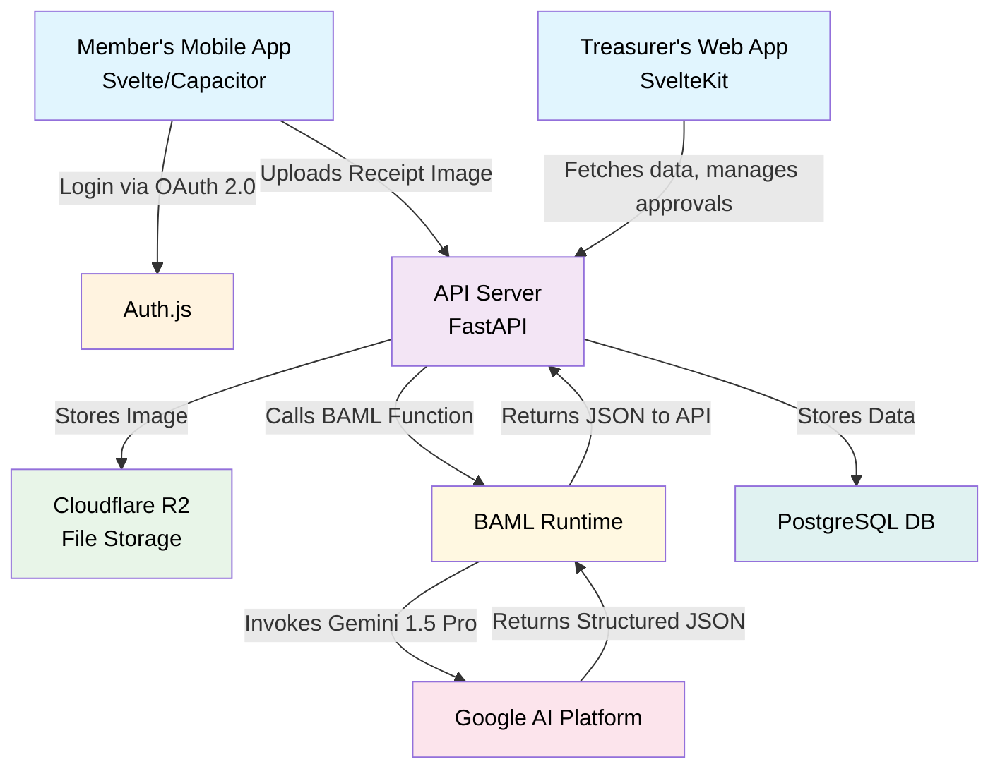

# Technical Specifications

[Project GitHub Repository](https://github.com/daniel-m7/GoodStewards)

## 1. Architecture Specification

This section outlines the proposed technical architecture, emphasizing open-source technologies, cost-effective hosting, and a maintainable, scalable structure.

### 1.1. Guiding Principles
*   **Open Source First:** Prioritize well-supported open-source libraries and frameworks to avoid vendor lock-in and manage costs.
*   **Cost-Effective Scalability:** Choose hosting and service providers that offer generous free tiers and predictable, affordable scaling paths.
*   **Lean & Modern Stack:** Employ technologies that enable rapid development and a small team to be highly effective.

### 1.2. Core Architecture Components

*   **Configuration:**
    *   A `config/` directory in the root of the repository will hold static configuration files.
    *   `nonrefundable_categories.json`: A JSON file containing a list of expense categories that are not eligible for a tax refund, based on Form E-585. This list will be loaded by the backend on startup and used to validate incoming receipt submissions.

*   **Frontend (Web & Mobile):** SvelteKit for the Treasurer Web Dashboard, packaged with Capacitor for the Member Mobile App.
*   **Backend API:** **FastAPI (Python)**. FastAPI is an excellent choice if the team has Python experience, especially for future data science tasks.
*   **AI Layer (Receipt Processing):**
    *   **BAML (Boundary-spanning Action and Meaning Language):** We will use BAML to define our AI functions for interacting with Google's Gemini 1.5 Pro.
    *   **How it works:** BAML allows us to define the `ExtractReceiptData` function declaratively, specifying its inputs (image) and outputs (structured JSON with vendor, date, taxes, expense_category, etc.). This separates the prompt engineering and LLM logic from the application code, making it highly maintainable and testable. The backend service will call the BAML-defined function, which then handles the API call to Gemini via a secure API key.
*   **Authentication & Authorization:**
    *   **Protocol:** **OAuth 2.0** will be the core protocol for secure authentication.
    *   **Implementation:** **Auth.js** (formerly NextAuth.js, now framework-agnostic) is a highly recommended open-source library that simplifies implementing OAuth with various providers (Google, etc.) and managing sessions.
    *   **Authorization:** A **Role-Based Access Control (RBAC)** system will be implemented in the backend. An authenticated user's token will contain their role (`treasurer` or `member`), which the API will use to protect endpoints and resources.
*   **Database:** **PostgreSQL**. It is a powerful, open-source, and reliable relational database. The implementation will use **psycopg3** as the driver to execute raw SQL queries. Database migrations will be handled by a dedicated library like `yoyo-migrations` or by executing SQL scripts.
*   **File Storage:** **Cloudflare R2**. This service offers S3-compatible APIs for storing receipt images but with significantly lower (or zero) egress fees, making it highly cost-effective compared to AWS S3.
*   **PDF Generation:** A server-side library like `PyPDF2` (Python) or `pdf-lib` (Node.js) to programmatically fill the Form E-585 and E-536R PDF templates.

### 1.3. Hosting Strategy

*   **Frontend:** **Vercel** or **Netlify**. Both offer excellent free tiers for hosting modern frontend applications, with global CDNs, CI/CD, and seamless integration with GitHub.
*   **Backend & Database:** **Render**. This platform simplifies deploying backend services and databases. It provides managed infrastructure with auto-scaling, predictable pricing, and generous free tiers to start.
*   **Containerization:** **Docker**. All backend services will be containerized using Docker. This approach ensures consistency between development, testing, and production environments, reducing the risk of environment-specific bugs. Docker containers also provide a lightweight, portable, and scalable way to deploy our application components, which aligns with our principles of cost-effective scalability and a lean, modern stack.

### 1.4. High-Level Architectural Flow

