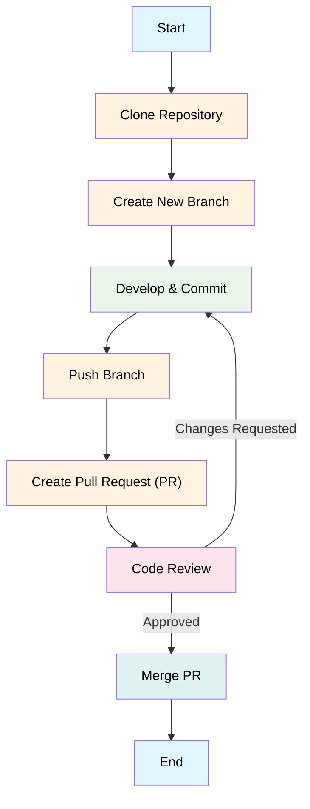

# Development Specifications

This document outlines the development environment setup and the Git collaboration workflow for the project.

## 1. Development Environment Setup

To set up your local development environment, follow these steps:

1.  **Clone the repository:**
    ```bash
    git clone https://github.com/daniel-m7/GoodStewards.git
    cd GoodStewards
    ```

2.  **Install Prerequisites:**
    *   **Docker and Docker Compose:** Ensure you have Docker Desktop (or Docker Engine and Docker Compose) installed.
    *   **Poetry:** Install Poetry for Python dependency management. See the [official documentation](https://python-poetry.org/docs/#installation).
    *   **pnpm:** Install pnpm for frontend dependency management (`npm install -g pnpm`).

3.  **Configure Environment Variables:**
    Create a `.env` file in the project root by copying the example file. On Windows, use `copy`; on macOS/Linux, use `cp`.
    ```bash
    # Windows
    copy .env.example .env

    # macOS / Linux
    cp .env.example .env
    ```
    Review the `.env` file. The defaults are configured to work with the local Docker Compose setup.

4.  **Install Backend Dependencies (for IDE support):**
    Navigate to the `backend/` directory and install dependencies using Poetry. This step is for your local IDE's IntelliSense and type-checking; the application itself will run inside Docker.
    ```bash
    cd backend
    poetry install
    cd ..
    ```

5.  **Run Backend & Database with Docker Compose:**
    From the root of the project, run:
    ```bash
    docker-compose up --build -d
    ```
    This command will:
    *   Build the backend Docker image from `backend/Dockerfile`.
    *   Start the FastAPI application container.
    *   Start the PostgreSQL database container.
    *   The backend API will be accessible at `http://localhost:8000`.
    *   The database will be accessible on `localhost:5432`.

6.  **Install Frontend Dependencies:**
    Navigate to the `frontend/` directory (once created) and install dependencies using pnpm:
    ```bash
    cd frontend
    pnpm install
    ```

7.  **Run Frontend Development Server:**
    ```bash
    pnpm run dev
    ```
    The frontend application will typically be available at `http://localhost:5173`.


## 2. Git Collaboration Workflow

This project is hosted on GitHub and follows a standard Gitflow-like branching strategy to ensure a smooth and collaborative development process.

*   **GitHub Project URL:** [https://github.com/daniel-m7/GoodStewards](https://github.com/daniel-m7/GoodStewards)

### 2.1. Branching Strategy

*   **`main` branch:** This branch always reflects the latest production-ready code. Only merged via pull requests from `release` branches.
*   **`develop` branch:** This is the main development branch. All new features and bug fixes are integrated here. Developers create feature branches from `develop`.
*   **`feature/<feature-name>` branches:** Created from `develop` for new features. Once a feature is complete and reviewed, it's merged back into `develop`.
*   **`bugfix/<bug-description>` branches:** Created from `develop` for bug fixes. Merged back into `develop` upon completion.
*   **`release/<version>` branches:** Created from `develop` when preparing a new release. Only critical bug fixes are allowed here. Once stable, it's merged into `main` and `develop`.
*   **`hotfix/<hotfix-description>` branches:** Created directly from `main` to quickly address critical production issues. Merged back into `main` and `develop`.

### 2.2. Workflow



1.  **Clone the repository:** `git clone https://github.com/daniel-m7/GoodStewards.git`
2.  **Create a new branch:** For features or bug fixes, always create a new branch from `develop`: `git checkout develop && git pull && git checkout -b feature/my-new-feature`
3.  **Develop and commit:** Make your changes, commit frequently with descriptive messages.
4.  **Push your branch:** `git push origin feature/my-new-feature`
5.  **Create a Pull Request (PR):** Open a PR from your feature/bugfix branch to `develop`. Ensure your PR description is clear and concise.
6.  **Code Review:** Address any feedback from reviewers.
7.  **Merge:** Once approved, merge your PR into `develop`.
8. **Delete Branch:** `git checkout main; git pull origin main`

## 3. Containerization (Docker)

To ensure a consistent and reproducible environment, the backend application will be containerized using Docker. This section outlines the steps to build and run the Docker container.

### 3.1. Dockerfile

A `Dockerfile` will be created in the root of the project with the following steps:

1.  **Base Image:** Start with an official Python base image (e.g., `python:3.11-slim`).
2.  **Set Working Directory:** Set the working directory inside the container (e.g., `/app`).
3.  **Copy Requirements:** Copy the `requirements.txt` file into the container and install the dependencies using `pip install -r requirements.txt`.
4.  **Copy Application Code:** Copy the rest of the application code into the container.
5.  **Expose Port:** Expose the port the FastAPI application will run on (e.g., 8000).
6.  **Run Command:** Use `CMD` to specify the command to run the application (e.g., `uvicorn main:app --host 0.0.0.0 --port 8000`).

### 3.2. Docker Compose

For local development, a `docker-compose.yml` file will be created to orchestrate the backend service and the PostgreSQL database.

*   **Services:**
    *   `backend`: Builds the Docker image from the `Dockerfile` and runs the FastAPI application.
    *   `db`: Uses the official `postgres` image and configures a volume to persist the database data.
*   **Networking:** Both services will be on the same Docker network to allow the backend to communicate with the database.
*   **Environment Variables:** The `docker-compose.yml` file will also manage environment variables for the backend service, such as database credentials and API keys.

### 3.3. Build and Run Steps

1.  **Build the Docker Image:**
    ```bash
    docker build -t goodstewards-backend .
    ```
2.  **Run with Docker Compose (for local development):**
    ```bash
    docker-compose up -d
    ```
3.  **Run the Container Manually (for production or testing):**
    ```bash
    docker run -d -p 8000:8000 --name goodstewards-backend goodstewards-backend
    ```