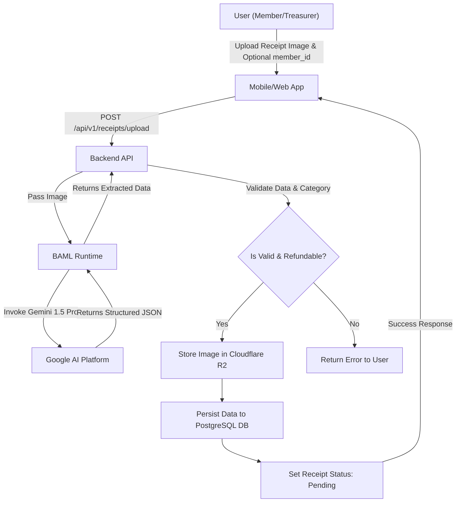
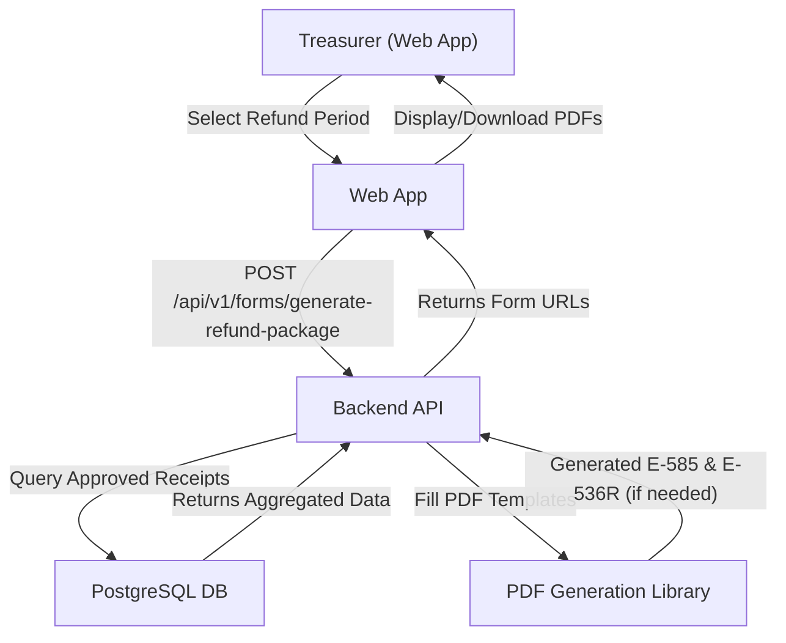
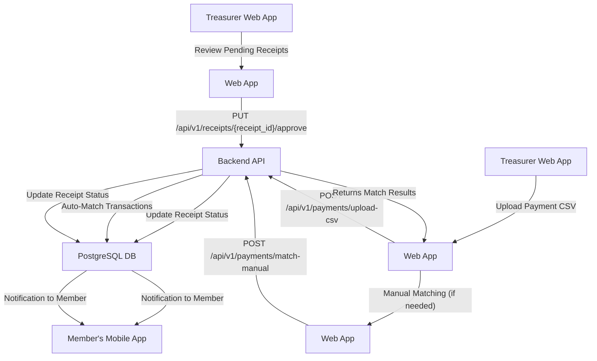
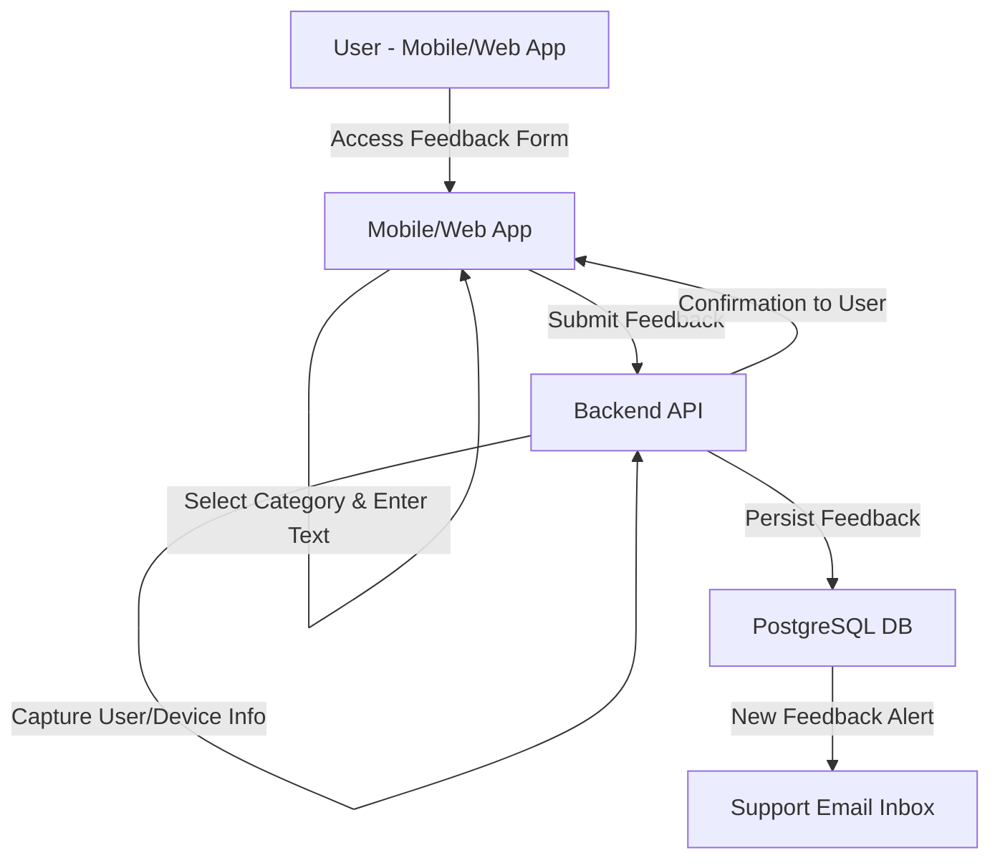
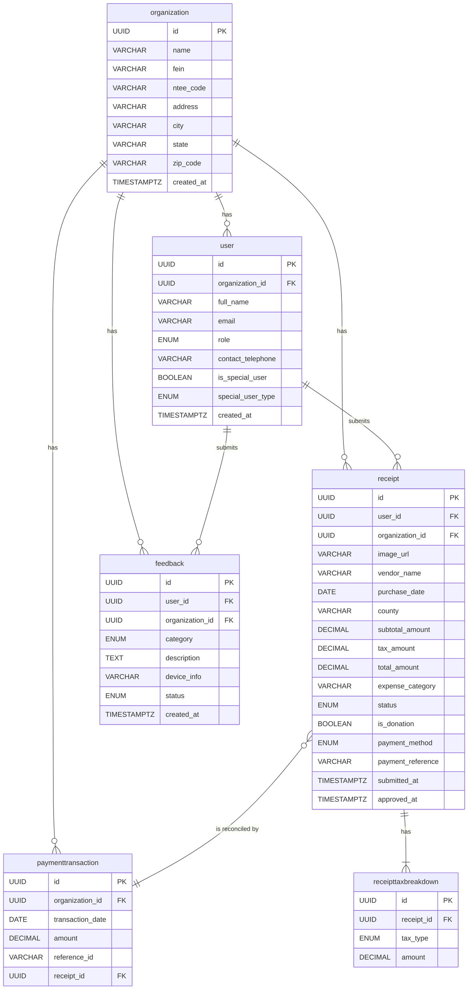

Technical Design Specification

This section provides detailed specifications for the API, data model, and user workflows.

### 2.2. API Specification

The backend API, built with FastAPI, provides RESTful endpoints for interaction with both the mobile and web applications. All API requests require authentication via OAuth 2.0 (handled by Auth.js) and are subject to Role-Based Access Control (RBAC).

#### 2.2.1. Authentication

* **POST /api/v1/auth/login**
    - **Description:** Initiates the OAuth 2.0 login flow.
    - **Request Body:** (Handled by Auth.js, typically redirects to OAuth provider)
    - **Response:** Redirects to the authenticated application.

#### 2.2.2. User & Organization Management

* **GET /api/v1/users/me**
    - **Description:** Retrieves the authenticated user's profile information.
    - **Authentication:** Required (Member or Treasurer role)
    - **Response Body (200 OK):**

      ```json
      {
          "id": "uuid-of-user",
          "organization_id": "uuid-of-organization",
          "full_name": "John Doe",
          "email": "john.doe@example.com",
          "role": "member"
      }
      ```
* **GET /api/v1/organizations/{organization_id}**
    - **Description:** Retrieves details for a specific organization.
    - **Authentication:** Required (Member or Treasurer role, must belong to the organization)
    - **Response Body (200 OK):**

      ```json
      {
          "id": "uuid-of-organization",
          "name": "Nonprofit Org",
          "fein": "12-3456789",
          "ntee_code": "A01",
          "address": "123 Main St",
          "city": "Anytown",
          "state": "NC",
          "zip_code": "12345"
      }
      ```
* **Note on Special Users:** To handle submissions for unknown members or anonymous donors (Use Case 2.5), each organization will have pre-defined user records for "Unknown User" and "Anonymous Donor". The treasurer can select these special users during the submission process when the actual member is not known or should be kept anonymous.

#### 2.2.3. Receipt Management

* **POST /api/v1/receipts/upload**
    - **Description:** Uploads a new receipt image for processing. Allows a treasurer to submit on behalf of a member.
    - **Authentication:** Required (Member or Treasurer role)
    - **Request Body (multipart/form-data):**
        - `image`: File upload (image of receipt)
        - `is_donation`: Boolean (optional, default: false)
        - `member_id`: String (optional, Treasurer only). The ID of the member this receipt is for. If omitted, defaults to the authenticated user.
    - **Response Body (202 Accepted):**

      ```json
      {
          "id": "uuid-of-new-receipt",
          "status": "processing",
          "image_url": "url-to-uploaded-image"
      }
      ```
* **GET /api/v1/receipts**
    - **Description:** Retrieves a list of receipts for the authenticated user/organization. Supports filtering and pagination.
    - **Authentication:** Required (Member or Treasurer role)
    - **Query Parameters:**
        - `status`: (optional) Filter by receipt status (e.g., `pending`, `approved`)
        - `user_id`: (optional, Treasurer only) Filter by specific user's receipts
        - `limit`: (optional) Number of results per page
        - `offset`: (optional) Offset for pagination
    - **Response Body (200 OK):**

      ```json
      [
          {
              "id": "uuid-of-receipt-1",
              "user_id": "uuid-of-user-1",
              "vendor_name": "Grocery Store",
              "purchase_date": "2023-01-15",
              "total_amount": 55.75,
              "status": "pending"
          },
          {
              "id": "uuid-of-receipt-2",
              "user_id": "uuid-of-user-2",
              "vendor_name": "Office Supplies",
              "purchase_date": "2023-01-10",
              "total_amount": 120.00,
              "status": "approved"
          }
      ]
      ```
* **GET /api/v1/receipts/{receipt_id}**
    - **Description:** Retrieves detailed information for a specific receipt.
    - **Authentication:** Required (Member or Treasurer role, must own or have access to receipt)
    - **Response Body (200 OK):**

      ```json
      {
          "id": "uuid-of-receipt",
          "user_id": "uuid-of-user",
          "organization_id": "uuid-of-organization",
          "image_url": "url-to-image",
          "vendor_name": "Grocery Store",
          "purchase_date": "2023-01-15",
          "county": "Wake",
          "subtotal_amount": 50.00,
          "tax_amount": 5.75,
          "total_amount": 55.75,
          "expense_category": "Food",
          "status": "pending",
          "is_donation": false,
          "submitted_at": "2023-01-15T10:00:00Z",
          "tax_breakdowns": [
              {"tax_type": "state", "amount": 3.00},
              {"tax_type": "county", "amount": 2.75}
          ]
      }
      ```
* **PUT /api/v1/receipts/{receipt_id}/approve**
    - **Description:** Approves a pending receipt.
    - **Authentication:** Required (Treasurer role)
    - **Request Body (JSON):**

      ```json
      {
          "payment_method": "zelle",
          "payment_reference": "ZELLE12345",
          "payment_proof_url": "url-to-zelle-screenshot"
      }
      ```
    - **Response Body (200 OK):**

      ```json
      {
          "id": "uuid-of-receipt",
          "status": "approved",
          "approved_at": "2023-01-16T11:00:00Z"
      }
      ```
* **PUT /api/v1/receipts/{receipt_id}/reject**
    - **Description:** Rejects a pending receipt.
    - **Authentication:** Required (Treasurer role)
    - **Request Body (JSON):**

      ```json
      {
          "reason": "Duplicate receipt"
      }
      ```
    - **Response Body (200 OK):**

      ```json
      {
          "id": "uuid-of-receipt",
          "status": "rejected"
      }
      ```

#### 2.2.4. Form Generation

* **POST /api/v1/forms/generate-refund-package**
    - **Description:** Generates a complete tax refund package, including Form E-585 and, if necessary, Form E-536R for a given period.
    - **Authentication:** Required (Treasurer role)
    - **Request Body (JSON):**

      ```json
      {
          "start_date": "2023-01-01",
          "end_date": "2023-06-30"
      }
      ```
    - **Response Body (200 OK):**

      ```json
      {
          "e585_form_url": "url-to-generated-e585-pdf",
          "e536r_form_url": "url-to-generated-e536r-pdf" 
      }
      ```

#### 2.2.5. Payment Reconciliation

* **POST /api/v1/payments/upload-csv**
    - **Description:** Uploads a CSV of payment transactions for reconciliation.
    - **Authentication:** Required (Treasurer role)
    - **Request Body (multipart/form-data):**
        - `csv_file`: File upload (CSV of payment transactions)
    - **Response Body (200 OK):**

      ```json
      {
          "message": "CSV uploaded and processing",
          "processed_records": 100,
          "matched_receipts": 80,
          "unmatched_records": 20
      }
      ```
* **POST /api/v1/payments/match-manual**
    - **Description:** Manually matches an unmatched payment transaction to a receipt.
    - **Authentication:** Required (Treasurer role)
    - **Request Body (JSON):**

      ```json
      {
          "transaction_id": "uuid-of-payment-transaction",
          "receipt_id": "uuid-of-receipt"
      }
      ```
    - **Response Body (200 OK):**

      ```json
      {
          "message": "Payment matched successfully"
      }
      ```

### 2.3. Use Case Workflows

This section outlines the key user-facing workflows within the GoodStewards application.

#### 2.3.1. Receipt Submission and AI Extraction Workflow (Use Case 1.1, 2.1, 2.6)

This workflow describes how users submit receipts and how the system processes them using AI.

1. **Receipt Submission (Mobile/Web App):**

   * A user (member or treasurer) captures or uploads a receipt image.
   * If the user is a Treasurer, they can optionally select an existing member (including special "Unknown User" or "Anonymous Donor" users) to submit the receipt on their behalf.
   * The image and any associated `member_id` are sent to the backend API endpoint (`POST /api/v1/receipts/upload`).
1. **Initial Processing & AI Extraction:**

   * The backend API receives the image and passes it to the BAML runtime for AI-powered data extraction.
   * The AI model attempts to extract key information (vendor, date, amounts, etc.) and validates the image as a legitimate receipt.
1. **Validation and Persistence:**

   * **Successful Extraction & Valid Receipt:** If the AI successfully extracts required information and the expense category is refundable (not in `config/nonrefundable_categories.json`), the image is stored in Cloudflare R2, the data is persisted to PostgreSQL, the status is set to `pending`, and a success response is returned.
   * **Failed Extraction or Invalid Receipt:** If the AI fails, the image is not persisted, and an error message is returned to the client (e.g., "Could not extract data," "Invalid receipt image," "Non-refundable category").



#### 2.3.2. Automated Form Generation Workflow (Use Case 1.2, 6.3)

This workflow describes how treasurers generate official tax refund forms (E-585 and E-536R).

1. **Initiate Form Generation (Web App):**

   * The treasurer selects a refund period in the web dashboard.
   * The web app sends a request to the backend API (`POST /api/v1/forms/generate-refund-package`) with the date range.
1. **Data Aggregation & PDF Generation:**

   * The backend API queries the PostgreSQL database to aggregate all approved receipt data for the period.
   * The aggregated data is used to programmatically fill the Form E-585 PDF template.
   * **E-536R Trigger:** The system checks if taxes were paid in more than one county. If so, it also generates Form E-536R, populating it with a county-by-county breakdown of taxes paid.
1. **Form Delivery:**

   * A JSON response containing URLs to the generated PDF(s) is returned to the web app.
   * The treasurer can then download, review, and print the completed forms for submission.



#### 2.3.3. Automated Reimbursement Workflow (Use Case 2.3)

This workflow details how treasurers approve member expenses and reconcile payments.

1. **Receipt Approval (Web App):**

   * A treasurer reviews pending receipts and, for an approved receipt, sends payment details to the backend (`PUT /api/v1/receipts/{receipt_id}/approve`).
1. **Payment Reconciliation (CSV Upload):**

   * The treasurer uploads a CSV of payment transactions (`POST /api/v1/payments/upload-csv`).
   * The backend attempts to automatically match transactions with approved receipts.
1. **Manual Matching:**

   * The treasurer can manually link any unmatched transactions or receipts (`POST /api/v1/payments/match-manual`).
1. **Status Updates:**

   * Members receive notifications on the status of their submitted receipts (approved, paid).



#### 2.3.4. In-App Feedback Submission Workflow (Use Case 3.1)

This workflow describes how users can submit feedback directly through the application.

1. **Initiate Feedback (Mobile/Web App):**

   * A user accesses the feedback form, selects a category, and provides a description.
1. **Feedback Submission:**

   * The app sends the feedback to a backend API endpoint. The backend captures user/device info and persists the feedback to the database.
1. **Persistence & Notification:**

   * The feedback is stored in a dedicated table.
   * An email notification is sent to a designated support inbox.



### 2.4. Data Model (PostgreSQL)

This is a simplified, high-level schema using SQLModel conventions with singular table names.

* **`organization`** (SQLModel: `Organization`)
    - `id` (PK, UUID)
    - `name` (VARCHAR)
    - `fein` (VARCHAR)
    - `ntee_code` (VARCHAR)
    - `address` (VARCHAR)
    - `city` (VARCHAR)
    - `state` (VARCHAR)
    - `zip_code` (VARCHAR)
    - `created_at` (TIMESTAMPTZ)
* **`user`** (SQLModel: `User`)
    - `id` (PK, UUID)
    - `organization_id` (FK to `organization.id`)
    - `full_name` (VARCHAR)
    - `email` (VARCHAR, UNIQUE)
    - `role` (ENUM: 'member', 'treasurer')
    - `contact_telephone` (VARCHAR, nullable)
    - `is_special_user` (BOOLEAN, default: false)
    - `special_user_type` (ENUM: 'anonymous_donor', 'unknown_user', 'one_time_donor', nullable)
    - `created_at` (TIMESTAMPTZ)
* **`receipt`** (SQLModel: `Receipt`)
    - `id` (PK, UUID)
    - `user_id` (FK to `user.id`)
    - `organization_id` (FK to `organization.id`)
    - `image_url` (VARCHAR)
    - `vendor_name` (VARCHAR, nullable)
    - `purchase_date` (DATE, nullable)
    - `county` (VARCHAR, nullable)
    - `subtotal_amount` (DECIMAL, nullable)
    - `tax_amount` (DECIMAL, nullable)
    - `total_amount` (DECIMAL, nullable)
    - `expense_category` (VARCHAR, nullable)
    - `status` (ENUM: 'processing', 'pending', 'approved', 'rejected', 'paid')
    - `is_donation` (BOOLEAN, default: false)
    - `payment_method` (ENUM: 'zelle', 'check', 'other', nullable)
    - `payment_reference` (VARCHAR, nullable) -- For Zelle transaction ID or check number
    - `submitted_at` (TIMESTAMPTZ)
    - `approved_at` (TIMESTAMPTZ, nullable)
* **`paymenttransaction`** (SQLModel: `PaymentTransaction`)
    - `id` (PK, UUID)
    - `organization_id` (FK to `organization.id`)
    - `transaction_date` (DATE)
    - `amount` (DECIMAL)
    - `reference_id` (VARCHAR, nullable) -- Zelle ID, check number
    - `receipt_id` (FK to `receipt.id`, nullable) -- The matched receipt
* **`receipttaxbreakdown`** (SQLModel: `ReceiptTaxBreakdown`)
    - `id` (PK, UUID)
    - `receipt_id` (FK to `receipt.id`)
    - `tax_type` (ENUM: 'state', 'county', 'transit', 'food')
    - `amount` (DECIMAL)
* **`feedback`** (SQLModel: `Feedback`)
    - `id` (PK, UUID)
    - `user_id` (FK to `user.id`)
    - `organization_id` (FK to `organization.id`)
    - `category` (ENUM: 'testimony', 'bug_report', 'feature_request')
    - `description` (TEXT)
    - `device_info` (VARCHAR, nullable) -- JSON as string
    - `status` (ENUM: 'submitted', 'in_review', 'resolved')
    - `created_at` (TIMESTAMPTZ)

### 2.5. Entity-Relationship Diagram (ERD)



### 2.6. Security Considerations

* **Data Encryption:** All data, both in transit (TLS/SSL) and at rest (database encryption), will be encrypted.
* **Access Control:** Strict RBAC will be enforced at the API level to ensure users can only access data they are authorized to view.
* **Secure File Uploads:** File uploads will be scanned for malware, and access to stored files will be restricted through signed URLs.
* **Dependency Scanning:** Automated tools will be used to scan for vulnerabilities in third-party libraries.
* **Secrets Management:** API keys, database credentials, and other secrets will be stored securely using environment variables or a dedicated secrets management service (e.g., Doppler, or the hosting provider's built-in solution).

### 2.7. Scalability and Performance

* **Stateless Backend:** The FastAPI backend will be stateless, allowing for horizontal scaling by simply adding more instances.
* **Asynchronous Processing:** Long-running tasks like AI data extraction and PDF generation can be offloaded to background workers (e.g., using Celery) to avoid blocking the main API.
* **Database Scaling:** Managed PostgreSQL services (like on Render) allow for easy vertical scaling (increasing CPU/RAM) and provide read replicas to handle high read loads.
* **CDN for Frontend:** Using Vercel/Netlify for the frontend ensures that static assets are served quickly from a global Content Delivery Network (CDN).