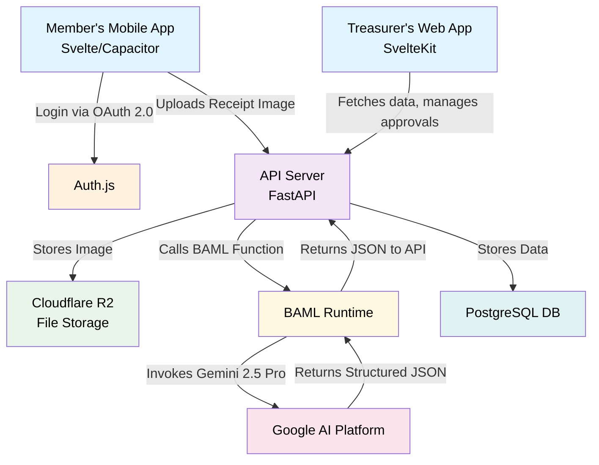
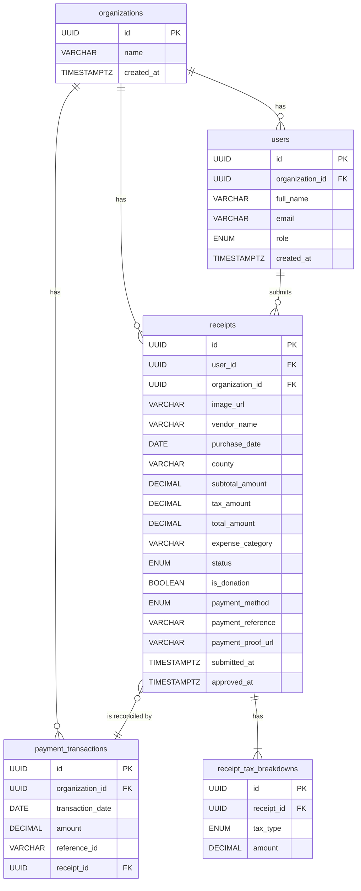

# Technical Architecture

This document outlines the proposed technical architecture, emphasizing open-source technologies, cost-effective hosting, and a maintainable, scalable structure.

### Guiding Principles
*   **Open Source First:** Prioritize well-supported open-source libraries and frameworks to avoid vendor lock-in and manage costs.
*   **Cost-Effective Scalability:** Choose hosting and service providers that offer generous free tiers and predictable, affordable scaling paths.
*   **Lean & Modern Stack:** Employ technologies that enable rapid development and a small team to be highly effective.

---

### Frontend Recommendation

Between the two proposed stacks, we recommend the **Svelte-based stack** for its simplicity, performance, and excellent developer experience, which is ideal for a startup.

*   **Recommendation: Svelte (SvelteKit + Capacitor)**
    *   **Web Dashboard:** **SvelteKit** provides a powerful, file-based routing and server-side rendering framework that is incredibly fast and intuitive.
    *   **Mobile App:** **Capacitor** allows us to wrap the Svelte web app into a native mobile shell for iOS and Android, providing access to native device features like the camera with minimal overhead. This "write once, adapt everywhere" approach is highly efficient.
*   **Why Svelte?**
    *   **Performance:** Svelte is a compiler that turns components into highly optimized, vanilla JavaScript at build time, resulting in smaller bundles and a faster app.
    *   **Simplicity:** The learning curve is gentle, and the code is often more concise and readable than other frameworks.
    *   **Unified Tooling:** The synergy between SvelteKit and Capacitor creates a seamless development workflow for both web and mobile.

---

### Core Architecture Components

*   **Configuration:**
    *   A `config/` directory in the root of the repository will hold static configuration files.
    *   `nonrefundable_categories.json`: A JSON file containing a list of expense categories that are not eligible for a tax refund, based on Form E-585. This list will be loaded by the backend on startup and used to validate incoming receipt submissions.

*   **Frontend (Web & Mobile):** SvelteKit for the Treasurer Web Dashboard, packaged with Capacitor for the Member Mobile App.
*   **Backend API:** **FastAPI (Python)**. FastAPI is an excellent choice if the team has Python experience, especially for future data science tasks.
*   **AI Layer (Receipt Processing):**
    *   **BAML (Boundary-spanning Action and Meaning Language):** We will use BAML to define our AI functions for interacting with Google's Gemini 1.5 Pro.
    *   **How it works:** BAML allows us to define the `ExtractReceiptData` function declaratively, specifying its inputs (image) and outputs (structured JSON with vendor, date, taxes, expense_category, etc.). This separates the prompt engineering and LLM logic from the application code, making it highly maintainable and testable. The backend service will call the BAML-defined function, which then handles the API call to Gemini via a secure API key.
*   **Authentication & Authorization:**
    *   **Protocol:** **OAuth 2.0** will be the core protocol for secure authentication.
    *   **Implementation:** **Auth.js** (formerly NextAuth.js, now framework-agnostic) is a highly recommended open-source library that simplifies implementing OAuth with various providers (Google, etc.) and managing sessions.
    *   **Authorization:** A **Role-Based Access Control (RBAC)** system will be implemented in the backend. An authenticated user's token will contain their role (`treasurer` or `member`), which the API will use to protect endpoints and resources.
*   **Database:** **PostgreSQL**. It is a powerful, open-source, and reliable relational database that is well-supported by all major cloud and hosting providers.
*   **File Storage:** **Cloudflare R2**. This service offers S3-compatible APIs for storing receipt images but with significantly lower (or zero) egress fees, making it highly cost-effective compared to AWS S3.
*   **PDF Generation:** A server-side library like `PyPDF2` (Python) or `pdf-lib` (Node.js) to programmatically fill the Form E-585 PDF template.

---

### Hosting Strategy

*   **Frontend:** **Vercel** or **Netlify**. Both offer excellent free tiers for hosting modern frontend applications, with global CDNs, CI/CD, and seamless integration with GitHub.
*   **Backend & Database:** **Render**. This platform simplifies deploying backend services and databases. It provides managed infrastructure with auto-scaling, predictable pricing, and generous free tiers to start.

### High-Level Architectural Flow

### Data Model (PostgreSQL)

This is a simplified, high-level schema.

*   **`organizations`**
    *   `id` (PK, UUID)
    *   `name` (VARCHAR)
    *   `address` (VARCHAR)
    *   `city` (VARCHAR)
    *   `state` (VARCHAR)
    *   `zip_code` (VARCHAR)
    *   `created_at` (TIMESTAMPTZ)

*   **`users`**
    *   `id` (PK, UUID)
    *   `organization_id` (FK to `organizations.id`)
    *   `full_name` (VARCHAR)
    *   `email` (VARCHAR, UNIQUE)
    *   `role` (ENUM: 'member', 'treasurer')
    *   `created_at` (TIMESTAMPTZ)

*   **`receipts`**
    *   `id` (PK, UUID)
    *   `user_id` (FK to `users.id`)
    *   `organization_id` (FK to `organizations.id`)
    *   `image_url` (VARCHAR)
    *   `vendor_name` (VARCHAR, nullable)
    *   `purchase_date` (DATE, nullable)
    *   `subtotal_amount` (DECIMAL, nullable)
    *   `tax_amount` (DECIMAL, nullable)
    *   `total_amount` (DECIMAL, nullable)
    *   `expense_category` (VARCHAR, nullable)
    *   `status` (ENUM: 'processing', 'pending', 'approved', 'rejected', 'paid')
    *   `is_donation` (BOOLEAN, default: false)
    *   `payment_method` (ENUM: 'zelle', 'check', 'other', nullable)
    *   `payment_reference` (VARCHAR, nullable) -- For Zelle transaction ID or check number
    *   `payment_proof_url` (VARCHAR, nullable) -- URL to the Zelle confirmation or check image
    *   `submitted_at` (TIMESTAMPTZ)
    *   `approved_at` (TIMESTAMPTZ, nullable)

*   **`payment_transactions`**
    *   `id` (PK, UUID)
    *   `organization_id` (FK to `organizations.id`)
    *   `transaction_date` (DATE)
    *   `amount` (DECIMAL)
    *   `reference_id` (VARCHAR, nullable) -- Zelle ID, check number
    *   `receipt_id` (FK to `receipts.id`, nullable) -- The matched receipt

*   **`receipt_tax_breakdowns`**
    *   `id` (PK, UUID)
    *   `receipt_id` (FK to `receipts.id`)
    *   `tax_type` (ENUM: 'state', 'county', 'transit', 'food')
    *   `amount` (DECIMAL)

### Entity-Relationship Diagram (ERD)

