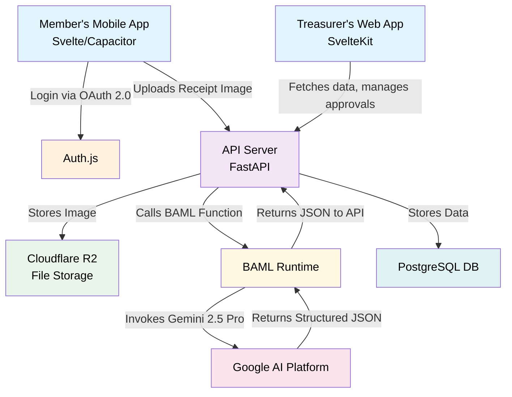
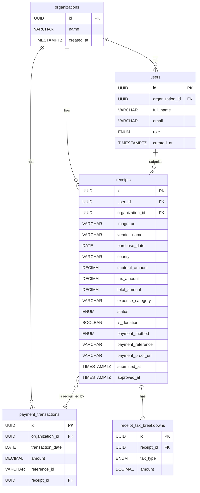

# Technical Architecture

[Project GitHub Repository](https://github.com/daniel-m7/GoodStewards)


This document outlines the proposed technical architecture, emphasizing open-source technologies, cost-effective hosting, and a maintainable, scalable structure.

### Guiding Principles
*   **Open Source First:** Prioritize well-supported open-source libraries and frameworks to avoid vendor lock-in and manage costs.
*   **Cost-Effective Scalability:** Choose hosting and service providers that offer generous free tiers and predictable, affordable scaling paths.
*   **Lean & Modern Stack:** Employ technologies that enable rapid development and a small team to be highly effective.

---

### Frontend Recommendation

Between the two proposed stacks, we recommend the **Svelte-based stack** for its simplicity, performance, and excellent developer experience, which is ideal for a startup.

*   **Recommendation: Svelte (SvelteKit + Capacitor)**
    *   **Web Dashboard:** **SvelteKit** provides a powerful, file-based routing and server-side rendering framework that is incredibly fast and intuitive.
    *   **Mobile App:** **Capacitor** allows us to wrap the Svelte web app into a native mobile shell for iOS and Android, providing access to native device features like the camera with minimal overhead. This "write once, adapt everywhere" approach is highly efficient.
*   **Why Svelte?**
    *   **Performance:** Svelte is a compiler that turns components into highly optimized, vanilla JavaScript at build time, resulting in smaller bundles and a faster app.
    *   **Simplicity:** The learning curve is gentle, and the code is often more concise and readable than other frameworks.
    *   **Unified Tooling:** The synergy between SvelteKit and Capacitor creates a seamless development workflow for both web and mobile.

---

### Core Architecture Components

*   **Configuration:**
    *   A `config/` directory in the root of the repository will hold static configuration files.
    *   `nonrefundable_categories.json`: A JSON file containing a list of expense categories that are not eligible for a tax refund, based on Form E-585. This list will be loaded by the backend on startup and used to validate incoming receipt submissions.

*   **Frontend (Web & Mobile):** SvelteKit for the Treasurer Web Dashboard, packaged with Capacitor for the Member Mobile App.
*   **Backend API:** **FastAPI (Python)**. FastAPI is an excellent choice if the team has Python experience, especially for future data science tasks.
*   **AI Layer (Receipt Processing):**
    *   **BAML (Boundary-spanning Action and Meaning Language):** We will use BAML to define our AI functions for interacting with Google's Gemini 1.5 Pro.
    *   **How it works:** BAML allows us to define the `ExtractReceiptData` function declaratively, specifying its inputs (image) and outputs (structured JSON with vendor, date, taxes, expense_category, etc.). This separates the prompt engineering and LLM logic from the application code, making it highly maintainable and testable. The backend service will call the BAML-defined function, which then handles the API call to Gemini via a secure API key.
*   **Authentication & Authorization:**
    *   **Protocol:** **OAuth 2.0** will be the core protocol for secure authentication.
    *   **Implementation:** **Auth.js** (formerly NextAuth.js, now framework-agnostic) is a highly recommended open-source library that simplifies implementing OAuth with various providers (Google, etc.) and managing sessions.
    *   **Authorization:** A **Role-Based Access Control (RBAC)** system will be implemented in the backend. An authenticated user's token will contain their role (`treasurer` or `member`), which the API will use to protect endpoints and resources.
*   **Database:** **PostgreSQL**. It is a powerful, open-source, and reliable relational database that is well-supported by all major cloud and hosting providers.
*   **File Storage:** **Cloudflare R2**. This service offers S3-compatible APIs for storing receipt images but with significantly lower (or zero) egress fees, making it highly cost-effective compared to AWS S3.
*   **PDF Generation:** A server-side library like `PyPDF2` (Python) or `pdf-lib` (Node.js) to programmatically fill the Form E-585 PDF template.

---

### Hosting Strategy

*   **Frontend:** **Vercel** or **Netlify**. Both offer excellent free tiers for hosting modern frontend applications, with global CDNs, CI/CD, and seamless integration with GitHub.
*   **Backend & Database:** **Render**. This platform simplifies deploying backend services and databases. It provides managed infrastructure with auto-scaling, predictable pricing, and generous free tiers to start.

### High-Level Architectural Flow



### API Specification

The backend API, built with FastAPI, provides RESTful endpoints for interaction with both the mobile and web applications. All API requests require authentication via OAuth 2.0 (handled by Auth.js) and are subject to Role-Based Access Control (RBAC).

#### Authentication

*   **POST /api/auth/login**
    *   **Description:** Initiates the OAuth 2.0 login flow.
    *   **Request Body:** (Handled by Auth.js, typically redirects to OAuth provider)
    *   **Response:** Redirects to the authenticated application.

#### User & Organization Management

*   **GET /api/users/me**
    *   **Description:** Retrieves the authenticated user's profile information.
    *   **Authentication:** Required (Member or Treasurer role)
    *   **Response Body (200 OK):**
        ```json
        {
            "id": "uuid-of-user",
            "organization_id": "uuid-of-organization",
            "full_name": "John Doe",
            "email": "john.doe@example.com",
            "role": "member"
        }
        ```

*   **GET /api/organizations/{organization_id}**
    *   **Description:** Retrieves details for a specific organization.
    *   **Authentication:** Required (Member or Treasurer role, must belong to the organization)
    *   **Response Body (200 OK):**
        ```json
        {
            "id": "uuid-of-organization",
            "name": "Nonprofit Org",
            "address": "123 Main St",
            "city": "Anytown",
            "state": "NC",
            "zip_code": "12345"
        }
        ```

#### Receipt Management

*   **POST /api/receipts/upload**
    *   **Description:** Uploads a new receipt image for processing.
    *   **Authentication:** Required (Member or Treasurer role)
    *   **Request Body (multipart/form-data):**
        *   `image`: File upload (image of receipt)
        *   `is_donation`: Boolean (optional, default: false)
    *   **Response Body (202 Accepted):**
        ```json
        {
            "id": "uuid-of-new-receipt",
            "status": "processing",
            "image_url": "url-to-uploaded-image"
        }
        ```

*   **GET /api/receipts**
    *   **Description:** Retrieves a list of receipts for the authenticated user/organization. Supports filtering and pagination.
    *   **Authentication:** Required (Member or Treasurer role)
    *   **Query Parameters:**
        *   `status`: (optional) Filter by receipt status (e.g., `pending`, `approved`)
        *   `user_id`: (optional, Treasurer only) Filter by specific user's receipts
        *   `limit`: (optional) Number of results per page
        *   `offset`: (optional) Offset for pagination
    *   **Response Body (200 OK):**
        ```json
        [
            {
                "id": "uuid-of-receipt-1",
                "user_id": "uuid-of-user-1",
                "vendor_name": "Grocery Store",
                "purchase_date": "2023-01-15",
                "total_amount": 55.75,
                "status": "pending"
            },
            {
                "id": "uuid-of-receipt-2",
                "user_id": "uuid-of-user-2",
                "vendor_name": "Office Supplies",
                "purchase_date": "2023-01-10",
                "total_amount": 120.00,
                "status": "approved"
            }
        ]
        ```

*   **GET /api/receipts/{receipt_id}**
    *   **Description:** Retrieves detailed information for a specific receipt.
    *   **Authentication:** Required (Member or Treasurer role, must own or have access to receipt)
    *   **Response Body (200 OK):**
        ```json
        {
            "id": "uuid-of-receipt",
            "user_id": "uuid-of-user",
            "organization_id": "uuid-of-organization",
            "image_url": "url-to-image",
            "vendor_name": "Grocery Store",
            "purchase_date": "2023-01-15",
            "subtotal_amount": 50.00,
            "tax_amount": 5.75,
            "total_amount": 55.75,
            "expense_category": "Food",
            "status": "pending",
            "is_donation": false,
            "submitted_at": "2023-01-15T10:00:00Z",
            "tax_breakdowns": [
                {"tax_type": "state", "amount": 3.00},
                {"tax_type": "county", "amount": 2.75}
            ]
        }
        ```

*   **PUT /api/receipts/{receipt_id}/approve**
    *   **Description:** Approves a pending receipt.
    *   **Authentication:** Required (Treasurer role)
    *   **Request Body (JSON):**
        ```json
        {
            "payment_method": "zelle",
            "payment_reference": "ZELLE12345",
            "payment_proof_url": "url-to-zelle-screenshot"
        }
        ```
    *   **Response Body (200 OK):**
        ```json
        {
            "id": "uuid-of-receipt",
            "status": "approved",
            "approved_at": "2023-01-16T11:00:00Z"
        }
        ```

*   **PUT /api/receipts/{receipt_id}/reject**
    *   **Description:** Rejects a pending receipt.
    *   **Authentication:** Required (Treasurer role)
    *   **Request Body (JSON):**
        ```json
        {
            "reason": "Duplicate receipt"
        }
        ```
    *   **Response Body (200 OK):**
        ```json
        {
            "id": "uuid-of-receipt",
            "status": "rejected"
        }
        ```

#### Form Generation

*   **POST /api/forms/e585/generate**
    *   **Description:** Generates a Form E-585 PDF for a given period.
    *   **Authentication:** Required (Treasurer role)
    *   **Request Body (JSON):**
        ```json
        {
            "start_date": "2023-01-01",
            "end_date": "2023-06-30"
        }
        ```
    *   **Response Body (200 OK):**
        ```json
        {
            "form_url": "url-to-generated-e585-pdf"
        }
        ```

#### Payment Reconciliation

*   **POST /api/payments/upload-csv**
    *   **Description:** Uploads a CSV of payment transactions for reconciliation.
    *   **Authentication:** Required (Treasurer role)
    *   **Request Body (multipart/form-data):**
        *   `csv_file`: File upload (CSV of payment transactions)
    *   **Response Body (200 OK):**
        ```json
        {
            "message": "CSV uploaded and processing",
            "processed_records": 100,
            "matched_receipts": 80,
            "unmatched_records": 20
        }
        ```

*   **POST /api/payments/match-manual**
    *   **Description:** Manually matches an unmatched payment transaction to a receipt.
    *   **Authentication:** Required (Treasurer role)
    *   **Request Body (JSON):**
        ```json
        {
            "transaction_id": "uuid-of-payment-transaction",
            "receipt_id": "uuid-of-receipt"
        }
        ```
    *   **Response Body (200 OK):**
        ```json
        {
            "message": "Payment matched successfully"
        }
        ```

### Use Case Workflows

This section outlines the key user-facing workflows within the GoodStewards application, detailing the interactions between the frontend applications (mobile and web), the backend API, and various third-party services.

#### 1. Receipt Submission and AI Extraction Workflow (Use Case 1.1 & 2.1)

This workflow describes how users submit receipts and how the system processes them using AI for data extraction and validation.

1.  **Receipt Submission (Mobile/Web App):**
    *   A user (member or treasurer) captures or uploads a receipt image via the mobile or web application.
    *   If the user is a Treasurer, they can optionally select an existing member to submit the receipt on behalf of.
    *   The image and any associated `member_id` are sent to the backend API endpoint (`POST /api/receipts/upload`).

2.  **Initial Processing & AI Extraction:**
    *   The backend API receives the image.
    *   The image is immediately passed to the BAML runtime for AI-powered data extraction (using the `ExtractReceiptData` function). This step does *not* yet persist the image or data.
    *   The AI model attempts to extract key information (vendor, date, amounts, etc.) and validates the image as a legitimate receipt.

3.  **Validation and Persistence:**
    *   **Successful Extraction & Valid Receipt:**
        *   If the AI successfully extracts all required information, determines the image is a valid receipt (e.g., not a blank image, clearly a receipt), and identifies the expense category as refundable (not in `config/nonrefundable_categories.json`), the following occurs:
            *   The original receipt image is securely stored in **Cloudflare R2**.
            *   The extracted structured data (along with a reference to the Cloudflare R2 image URL) is persisted to the **PostgreSQL database** in the `receipts` table.
            *   The receipt's status is set to `pending` for treasurer review.
            *   A success response is returned to the client.
    *   **Failed Extraction or Invalid Receipt:**
        *   If the AI fails to extract required information, determines the image is not a valid receipt (e.g., blurry, not a receipt, missing critical data), or identifies the expense category as non-refundable (as defined in `config/nonrefundable_categories.json`), the following occurs:
            *   The image is *not* persisted to Cloudflare R2.
            *   No data is persisted to the PostgreSQL database.
            *   An appropriate error message is returned to the client, indicating the reason for failure (e.g., "Could not extract data," "Invalid receipt image," "Non-refundable category").

```mermaid
graph TD
    A[User (Member/Treasurer)] -- Upload Receipt Image --> B(Mobile/Web App)
    B -- POST /api/receipts/upload --> C(Backend API)
    C -- Pass Image --> D(BAML Runtime)
    D -- Invoke Gemini 2.5 Pro --> E(Google AI Platform)
    E -- Returns Structured JSON --> D
    D -- Returns Extracted Data --> C
    C -- Validate Data & Category --> F{Is Valid & Refundable?}
    F -- Yes --> G(Store Image in Cloudflare R2)
    G --> H(Persist Data to PostgreSQL DB)
    H --> I(Set Receipt Status: Pending)
    I -- Success Response --> B
    F -- No --> J(Return Error to User)
```

#### 2. Automated Form Generation Workflow (Use Case 1.2)

This workflow describes how treasurers generate official tax refund forms (E-585) based on approved receipts.

1.  **Initiate Form Generation (Web App):**
    *   The treasurer selects a refund period (e.g., a specific semiannual period) in the web dashboard.
    *   The web app sends a request to the backend API (`POST /api/forms/e585/generate`) with the selected date range.

2.  **Data Aggregation & PDF Generation:**
    *   The backend API queries the PostgreSQL database to aggregate all approved receipt data within the specified refund period for the organization.
    *   The aggregated data is used to programmatically fill the Form E-585 PDF template using a server-side PDF library.

3.  **Form Delivery:**
    *   The generated PDF is temporarily stored or streamed.
    *   A URL to the generated PDF is returned to the web app.
    *   The treasurer can then download, review, and print the completed Form E-585 for submission to NCDOR.

```mermaid
graph TD
    A[Treasurer (Web App)] -- Select Refund Period --> B(Web App)
    B -- POST /api/forms/e585/generate --> C(Backend API)
    C -- Query Approved Receipts --> D(PostgreSQL DB)
    D -- Returns Aggregated Data --> C
    C -- Fill PDF Template --> E(PDF Generation Library)
    E -- Generated PDF --> C
    C -- Returns Form URL --> B
    B -- Display/Download PDF --> A
```

#### 3. Automated Reimbursement Workflow (Use Case 2.3)

This workflow details how treasurers approve member expenses and reconcile payments.

1.  **Receipt Approval (Web App):**
    *   A treasurer reviews pending receipts in the web dashboard.
    *   For an approved receipt, the treasurer provides payment details (method, reference, proof URL) and sends a request to the backend (`PUT /api/receipts/{receipt_id}/approve`).

2.  **Payment Reconciliation (CSV Upload):**
    *   The treasurer uploads a CSV file containing payment transactions (e.g., from Zelle or bank export) to the backend (`POST /api/payments/upload-csv`).
    *   The backend attempts to automatically match transactions in the CSV with approved receipts based on payment reference and amount.

3.  **Manual Matching:**
    *   For any unmatched transactions or receipts, the treasurer can manually link them in the web dashboard (`POST /api/payments/match-manual`).

4.  **Status Updates:**
    *   Members receive notifications (e.g., in-app, email) on the status of their submitted receipts (approved, paid).

```mermaid
graph TD
    A[Treasurer (Web App)] -- Review Pending Receipts --> B(Web App)
    B -- PUT /api/receipts/{receipt_id}/approve --> C(Backend API)
    C -- Update Receipt Status --> D(PostgreSQL DB)
    D -- Notification to Member --> E(Member's Mobile App)

    F[Treasurer (Web App)] -- Upload Payment CSV --> G(Web App)
    G -- POST /api/payments/upload-csv --> C
    C -- Auto-Match Transactions --> D
    C -- Returns Match Results --> G
    G -- Manual Matching (if needed) --> H(Web App)
    H -- POST /api/payments/match-manual --> C
    C -- Update Receipt Status --> D
    D -- Notification to Member --> E
```

#### 4. In-App Feedback Submission Workflow (Use Case 3.1)

This workflow describes how users can submit feedback directly through the application.

1.  **Initiate Feedback (Mobile/Web App):**
    *   A user accesses the feedback submission interface within the mobile or web application.
    *   The user categorizes their feedback (e.g., Bug Report, Feature Request, Testimony) and provides a free-text description.

2.  **Feedback Submission:**
    *   The application sends the feedback data to a backend API endpoint.
    *   The backend automatically captures relevant user and device information (e.g., user ID, app version, OS) for bug reports.

3.  **Persistence & Notification:**
    *   The feedback is persisted to a dedicated table in the PostgreSQL database.
    *   An email notification is sent to a designated support inbox, alerting the team to new feedback.

```mermaid
graph TD
    A[User (Mobile/Web App)] -- Access Feedback Form --> B(Mobile/Web App)
    B -- Select Category & Enter Text --> B
    B -- Submit Feedback --> C(Backend API)
    C -- Capture User/Device Info --> C
    C -- Persist Feedback --> D(PostgreSQL DB)
    D -- New Feedback Alert --> E(Support Email Inbox)
    C -- Confirmation to User --> B
```

#### 2. Automated Form Generation Workflow (Use Case 1.2)

This workflow describes how treasurers generate official tax refund forms (E-585) based on approved receipts.

1.  **Initiate Form Generation (Web App):**
    *   The treasurer selects a refund period (e.g., a specific semiannual period) in the web dashboard.
    *   The web app sends a request to the backend API (`POST /api/forms/e585/generate`) with the selected date range.

2.  **Data Aggregation & PDF Generation:**
    *   The backend API queries the PostgreSQL database to aggregate all approved receipt data within the specified refund period for the organization.
    *   The aggregated data is used to programmatically fill the Form E-585 PDF template using a server-side PDF library.

3.  **Form Delivery:**
    *   The generated PDF is temporarily stored or streamed.
    *   A URL to the generated PDF is returned to the web app.
    *   The treasurer can then download, review, and print the completed Form E-585 for submission to NCDOR.

```mermaid
graph TD
    A[Treasurer (Web App)] -- Select Refund Period --> B(Web App)
    B -- POST /api/forms/e585/generate --> C(Backend API)
    C -- Query Approved Receipts --> D(PostgreSQL DB)
    D -- Returns Aggregated Data --> C
    C -- Fill PDF Template --> E(PDF Generation Library)
    E -- Generated PDF --> C
    C -- Returns Form URL --> B
    B -- Display/Download PDF --> A
```

#### 3. Automated Reimbursement Workflow (Use Case 2.3)

This workflow details how treasurers approve member expenses and reconcile payments.

1.  **Receipt Approval (Web App):**
    *   A treasurer reviews pending receipts in the web dashboard.
    *   For an approved receipt, the treasurer provides payment details (method, reference, proof URL) and sends a request to the backend (`PUT /api/receipts/{receipt_id}/approve`).

2.  **Payment Reconciliation (CSV Upload):**
    *   The treasurer uploads a CSV file containing payment transactions (e.g., from Zelle or bank export) to the backend (`POST /api/payments/upload-csv`).
    *   The backend attempts to automatically match transactions in the CSV with approved receipts based on payment reference and amount.

3.  **Manual Matching:**
    *   For any unmatched transactions or receipts, the treasurer can manually link them in the web dashboard (`POST /api/payments/match-manual`).

4.  **Status Updates:**
    *   Members receive notifications (e.g., in-app, email) on the status of their submitted receipts (approved, paid).

```mermaid
graph TD
    A[Treasurer (Web App)] -- Review Pending Receipts --> B(Web App)
    B -- PUT /api/receipts/{receipt_id}/approve --> C(Backend API)
    C -- Update Receipt Status --> D(PostgreSQL DB)
    D -- Notification to Member --> E(Member's Mobile App)

    F[Treasurer (Web App)] -- Upload Payment CSV --> G(Web App)
    G -- POST /api/payments/upload-csv --> C
    C -- Auto-Match Transactions --> D
    C -- Returns Match Results --> G
    G -- Manual Matching (if needed) --> H(Web App)
    H -- POST /api/payments/match-manual --> C
    C -- Update Receipt Status --> D
    D -- Notification to Member --> E
```

#### 4. In-App Feedback Submission Workflow (Use Case 3.1)

This workflow describes how users can submit feedback directly through the application.

1.  **Initiate Feedback (Mobile/Web App):**
    *   A user accesses the feedback submission interface within the mobile or web application.
    *   The user categorizes their feedback (e.g., Bug Report, Feature Request, Testimony) and provides a free-text description.

2.  **Feedback Submission:**
    *   The application sends the feedback data to a backend API endpoint.
    *   The backend automatically captures relevant user and device information (e.g., user ID, app version, OS) for bug reports.

3.  **Persistence & Notification:**
    *   The feedback is persisted to a dedicated table in the PostgreSQL database.
    *   An email notification is sent to a designated support inbox, alerting the team to new feedback.

```mermaid
graph TD
    A[User (Mobile/Web App)] -- Access Feedback Form --> B(Mobile/Web App)
    B -- Select Category & Enter Text --> B
    B -- Submit Feedback --> C(Backend API)
    C -- Capture User/Device Info --> C
    C -- Persist Feedback --> D(PostgreSQL DB)
    D -- New Feedback Alert --> E(Support Email Inbox)
    C -- Confirmation to User --> B
```

### Data Model (PostgreSQL)

This is a simplified, high-level schema.

*   **`organizations`**
    *   `id` (PK, UUID)
    *   `name` (VARCHAR)
    *   `address` (VARCHAR)
    *   `city` (VARCHAR)
    *   `state` (VARCHAR)
    *   `zip_code` (VARCHAR)
    *   `created_at` (TIMESTAMPTZ)

*   **`users`**
    *   `id` (PK, UUID)
    *   `organization_id` (FK to `organizations.id`)
    *   `full_name` (VARCHAR)
    *   `email` (VARCHAR, UNIQUE)
    *   `role` (ENUM: 'member', 'treasurer')
    *   `created_at` (TIMESTAMPTZ)

*   **`receipts`**
    *   `id` (PK, UUID)
    *   `user_id` (FK to `users.id`)
    *   `organization_id` (FK to `organizations.id`)
    *   `image_url` (VARCHAR)
    *   `vendor_name` (VARCHAR, nullable)
    *   `purchase_date` (DATE, nullable)
    *   `subtotal_amount` (DECIMAL, nullable)
    *   `tax_amount` (DECIMAL, nullable)
    *   `total_amount` (DECIMAL, nullable)
    *   `expense_category` (VARCHAR, nullable)
    *   `status` (ENUM: 'processing', 'pending', 'approved', 'rejected', 'paid')
    *   `is_donation` (BOOLEAN, default: false)
    *   `payment_method` (ENUM: 'zelle', 'check', 'other', nullable)
    *   `payment_reference` (VARCHAR, nullable) -- For Zelle transaction ID or check number
    *   `payment_proof_url` (VARCHAR, nullable) -- URL to the Zelle confirmation or check image
    *   `submitted_at` (TIMESTAMPTZ)
    *   `approved_at` (TIMESTAMPTZ, nullable)

*   **`payment_transactions`**
    *   `id` (PK, UUID)
    *   `organization_id` (FK to `organizations.id`)
    *   `transaction_date` (DATE)
    *   `amount` (DECIMAL)
    *   `reference_id` (VARCHAR, nullable) -- Zelle ID, check number
    *   `receipt_id` (FK to `receipts.id`, nullable) -- The matched receipt

*   **`receipt_tax_breakdowns`**
    *   `id` (PK, UUID)
    *   `receipt_id` (FK to `receipts.id`)
    *   `tax_type` (ENUM: 'state', 'county', 'transit', 'food')
    *   `amount` (DECIMAL)

### Entity-Relationship Diagram (ERD)

