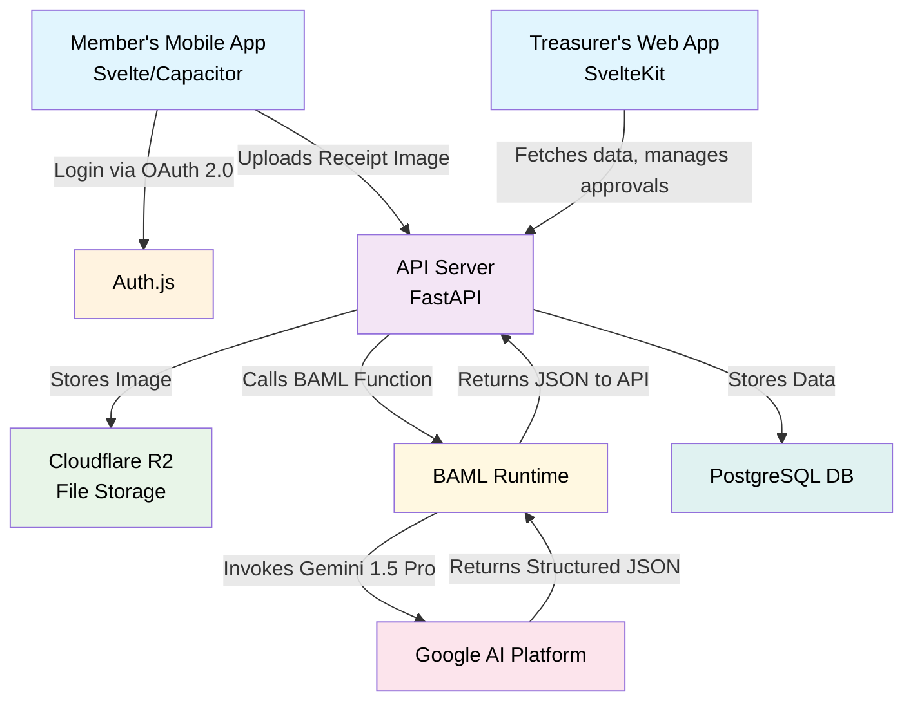
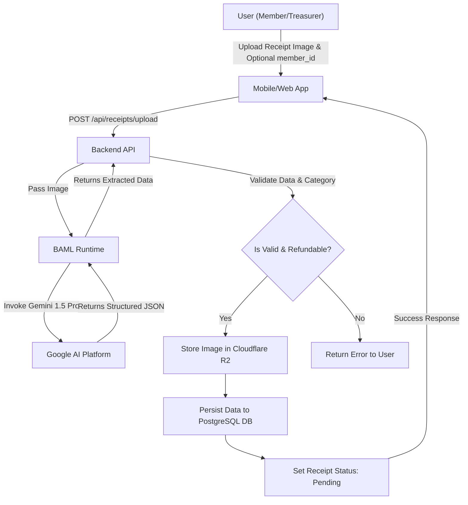
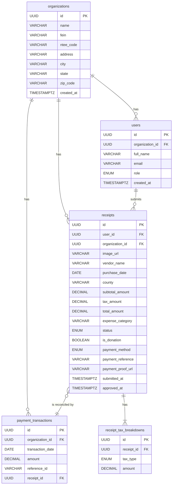

# Technical Specifications

[Project GitHub Repository](https://github.com/daniel-m7/GoodStewards)

This document is divided into two main sections: the **Architecture Specification**, which provides a high-level overview of the system's structure and technologies, and the **Technical Design Specification**, which details the implementation specifics.

---

## 1. Architecture Specification

This section outlines the proposed technical architecture, emphasizing open-source technologies, cost-effective hosting, and a maintainable, scalable structure.

### 1.1. Guiding Principles
*   **Open Source First:** Prioritize well-supported open-source libraries and frameworks to avoid vendor lock-in and manage costs.
*   **Cost-Effective Scalability:** Choose hosting and service providers that offer generous free tiers and predictable, affordable scaling paths.
*   **Lean & Modern Stack:** Employ technologies that enable rapid development and a small team to be highly effective.

### 1.2. Core Architecture Components

*   **Configuration:**
    *   A `config/` directory in the root of the repository will hold static configuration files.
    *   `nonrefundable_categories.json`: A JSON file containing a list of expense categories that are not eligible for a tax refund, based on Form E-585. This list will be loaded by the backend on startup and used to validate incoming receipt submissions.

*   **Frontend (Web & Mobile):** SvelteKit for the Treasurer Web Dashboard, packaged with Capacitor for the Member Mobile App.
*   **Backend API:** **FastAPI (Python)**. FastAPI is an excellent choice if the team has Python experience, especially for future data science tasks.
*   **AI Layer (Receipt Processing):**
    *   **BAML (Boundary-spanning Action and Meaning Language):** We will use BAML to define our AI functions for interacting with Google's Gemini 1.5 Pro.
    *   **How it works:** BAML allows us to define the `ExtractReceiptData` function declaratively, specifying its inputs (image) and outputs (structured JSON with vendor, date, taxes, expense_category, etc.). This separates the prompt engineering and LLM logic from the application code, making it highly maintainable and testable. The backend service will call the BAML-defined function, which then handles the API call to Gemini via a secure API key.
*   **Authentication & Authorization:**
    *   **Protocol:** **OAuth 2.0** will be the core protocol for secure authentication.
    *   **Implementation:** **Auth.js** (formerly NextAuth.js, now framework-agnostic) is a highly recommended open-source library that simplifies implementing OAuth with various providers (Google, etc.) and managing sessions.
    *   **Authorization:** A **Role-Based Access Control (RBAC)** system will be implemented in the backend. An authenticated user's token will contain their role (`treasurer` or `member`), which the API will use to protect endpoints and resources.
*   **Database:** **PostgreSQL**. It is a powerful, open-source, and reliable relational database. The implementation will use **psycopg3** as the driver and **Alembic** for handling database migrations.
*   **File Storage:** **Cloudflare R2**. This service offers S3-compatible APIs for storing receipt images but with significantly lower (or zero) egress fees, making it highly cost-effective compared to AWS S3.
*   **PDF Generation:** A server-side library like `PyPDF2` (Python) or `pdf-lib` (Node.js) to programmatically fill the Form E-585 and E-536R PDF templates.

### 1.3. Hosting Strategy

*   **Frontend:** **Vercel** or **Netlify**. Both offer excellent free tiers for hosting modern frontend applications, with global CDNs, CI/CD, and seamless integration with GitHub.
*   **Backend & Database:** **Render**. This platform simplifies deploying backend services and databases. It provides managed infrastructure with auto-scaling, predictable pricing, and generous free tiers to start.
*   **Containerization:** **Docker**. All backend services will be containerized using Docker. This approach ensures consistency between development, testing, and production environments, reducing the risk of environment-specific bugs. Docker containers also provide a lightweight, portable, and scalable way to deploy our application components, which aligns with our principles of cost-effective scalability and a lean, modern stack.

### 1.4. High-Level Architectural Flow



---

## 2. Technical Design Specification

This section provides detailed specifications for the API, data model, and user workflows.

### 2.1. API Specification

The backend API, built with FastAPI, provides RESTful endpoints for interaction with both the mobile and web applications. All API requests require authentication via OAuth 2.0 (handled by Auth.js) and are subject to Role-Based Access Control (RBAC).

#### 2.1.1. Authentication

*   **POST /api/auth/login**
    *   **Description:** Initiates the OAuth 2.0 login flow.
    *   **Request Body:** (Handled by Auth.js, typically redirects to OAuth provider)
    *   **Response:** Redirects to the authenticated application.

#### 2.1.2. User & Organization Management

*   **GET /api/users/me**
    *   **Description:** Retrieves the authenticated user's profile information.
    *   **Authentication:** Required (Member or Treasurer role)
    *   **Response Body (200 OK):**
        ```json
        {
            "id": "uuid-of-user",
            "organization_id": "uuid-of-organization",
            "full_name": "John Doe",
            "email": "john.doe@example.com",
            "role": "member"
        }
        ```

*   **GET /api/organizations/{organization_id}**
    *   **Description:** Retrieves details for a specific organization.
    *   **Authentication:** Required (Member or Treasurer role, must belong to the organization)
    *   **Response Body (200 OK):**
        ```json
        {
            "id": "uuid-of-organization",
            "name": "Nonprofit Org",
            "fein": "12-3456789",
            "ntee_code": "A01",
            "address": "123 Main St",
            "city": "Anytown",
            "state": "NC",
            "zip_code": "12345"
        }
        ```
*   **Note on Special Users:** To handle submissions for unknown members or anonymous donors (Use Case 2.5), each organization will have pre-defined user records for "Unknown User" and "Anonymous Donor". The treasurer can select these special users during the submission process when the actual member is not known or should be kept anonymous.

#### 2.1.3. Receipt Management

*   **POST /api/receipts/upload**
    *   **Description:** Uploads a new receipt image for processing. Allows a treasurer to submit on behalf of a member.
    *   **Authentication:** Required (Member or Treasurer role)
    *   **Request Body (multipart/form-data):**
        *   `image`: File upload (image of receipt)
        *   `is_donation`: Boolean (optional, default: false)
        *   `member_id`: String (optional, Treasurer only). The ID of the member this receipt is for. If omitted, defaults to the authenticated user.
    *   **Response Body (202 Accepted):**
        ```json
        {
            "id": "uuid-of-new-receipt",
            "status": "processing",
            "image_url": "url-to-uploaded-image"
        }
        ```

*   **GET /api/receipts**
    *   **Description:** Retrieves a list of receipts for the authenticated user/organization. Supports filtering and pagination.
    *   **Authentication:** Required (Member or Treasurer role)
    *   **Query Parameters:**
        *   `status`: (optional) Filter by receipt status (e.g., `pending`, `approved`)
        *   `user_id`: (optional, Treasurer only) Filter by specific user's receipts
        *   `limit`: (optional) Number of results per page
        *   `offset`: (optional) Offset for pagination
    *   **Response Body (200 OK):**
        ```json
        [
            {
                "id": "uuid-of-receipt-1",
                "user_id": "uuid-of-user-1",
                "vendor_name": "Grocery Store",
                "purchase_date": "2023-01-15",
                "total_amount": 55.75,
                "status": "pending"
            },
            {
                "id": "uuid-of-receipt-2",
                "user_id": "uuid-of-user-2",
                "vendor_name": "Office Supplies",
                "purchase_date": "2023-01-10",
                "total_amount": 120.00,
                "status": "approved"
            }
        ]
        ```

*   **GET /api/receipts/{receipt_id}**
    *   **Description:** Retrieves detailed information for a specific receipt.
    *   **Authentication:** Required (Member or Treasurer role, must own or have access to receipt)
    *   **Response Body (200 OK):**
        ```json
        {
            "id": "uuid-of-receipt",
            "user_id": "uuid-of-user",
            "organization_id": "uuid-of-organization",
            "image_url": "url-to-image",
            "vendor_name": "Grocery Store",
            "purchase_date": "2023-01-15",
            "county": "Wake",
            "subtotal_amount": 50.00,
            "tax_amount": 5.75,
            "total_amount": 55.75,
            "expense_category": "Food",
            "status": "pending",
            "is_donation": false,
            "submitted_at": "2023-01-15T10:00:00Z",
            "tax_breakdowns": [
                {"tax_type": "state", "amount": 3.00},
                {"tax_type": "county", "amount": 2.75}
            ]
        }
        ```

*   **PUT /api/receipts/{receipt_id}/approve**
    *   **Description:** Approves a pending receipt.
    *   **Authentication:** Required (Treasurer role)
    *   **Request Body (JSON):**
        ```json
        {
            "payment_method": "zelle",
            "payment_reference": "ZELLE12345",
            "payment_proof_url": "url-to-zelle-screenshot"
        }
        ```
    *   **Response Body (200 OK):**
        ```json
        {
            "id": "uuid-of-receipt",
            "status": "approved",
            "approved_at": "2023-01-16T11:00:00Z"
        }
        ```

*   **PUT /api/receipts/{receipt_id}/reject**
    *   **Description:** Rejects a pending receipt.
    *   **Authentication:** Required (Treasurer role)
    *   **Request Body (JSON):**
        ```json
        {
            "reason": "Duplicate receipt"
        }
        ```
    *   **Response Body (200 OK):**
        ```json
        {
            "id": "uuid-of-receipt",
            "status": "rejected"
        }
        ```

#### 2.1.4. Form Generation

*   **POST /api/forms/generate-refund-package**
    *   **Description:** Generates a complete tax refund package, including Form E-585 and, if necessary, Form E-536R for a given period.
    *   **Authentication:** Required (Treasurer role)
    *   **Request Body (JSON):**
        ```json
        {
            "start_date": "2023-01-01",
            "end_date": "2023-06-30"
        }
        ```
    *   **Response Body (200 OK):**
        ```json
        {
            "e585_form_url": "url-to-generated-e585-pdf",
            "e536r_form_url": "url-to-generated-e536r-pdf" 
        }
        ```

#### 2.1.5. Payment Reconciliation

*   **POST /api/payments/upload-csv**
    *   **Description:** Uploads a CSV of payment transactions for reconciliation.
    *   **Authentication:** Required (Treasurer role)
    *   **Request Body (multipart/form-data):**
        *   `csv_file`: File upload (CSV of payment transactions)
    *   **Response Body (200 OK):**
        ```json
        {
            "message": "CSV uploaded and processing",
            "processed_records": 100,
            "matched_receipts": 80,
            "unmatched_records": 20
        }
        ```

*   **POST /api/payments/match-manual**
    *   **Description:** Manually matches an unmatched payment transaction to a receipt.
    *   **Authentication:** Required (Treasurer role)
    *   **Request Body (JSON):**
        ```json
        {
            "transaction_id": "uuid-of-payment-transaction",
            "receipt_id": "uuid-of-receipt"
        }
        ```
    *   **Response Body (200 OK):**
        ```json
        {
            "message": "Payment matched successfully"
        }
        ```

### 2.2. Use Case Workflows

This section outlines the key user-facing workflows within the GoodStewards application.

#### 2.2.1. Receipt Submission and AI Extraction Workflow (Use Case 1.1, 2.1, 2.6)

This workflow describes how users submit receipts and how the system processes them using AI.

1.  **Receipt Submission (Mobile/Web App):**
    *   A user (member or treasurer) captures or uploads a receipt image.
    *   If the user is a Treasurer, they can optionally select an existing member (including special "Unknown User" or "Anonymous Donor" users) to submit the receipt on their behalf.
    *   The image and any associated `member_id` are sent to the backend API endpoint (`POST /api/receipts/upload`).

2.  **Initial Processing & AI Extraction:**
    *   The backend API receives the image and passes it to the BAML runtime for AI-powered data extraction.
    *   The AI model attempts to extract key information (vendor, date, amounts, etc.) and validates the image as a legitimate receipt.

3.  **Validation and Persistence:**
    *   **Successful Extraction & Valid Receipt:** If the AI successfully extracts required information and the expense category is refundable (not in `config/nonrefundable_categories.json`), the image is stored in Cloudflare R2, the data is persisted to PostgreSQL, the status is set to `pending`, and a success response is returned.
    *   **Failed Extraction or Invalid Receipt:** If the AI fails, the image is not persisted, and an error message is returned to the client (e.g., "Could not extract data," "Invalid receipt image," "Non-refundable category").



#### 2.2.2. Automated Form Generation Workflow (Use Case 1.2, 6.3)

This workflow describes how treasurers generate official tax refund forms (E-585 and E-536R).

1.  **Initiate Form Generation (Web App):**
    *   The treasurer selects a refund period in the web dashboard.
    *   The web app sends a request to the backend API (`POST /api/forms/generate-refund-package`) with the date range.

2.  **Data Aggregation & PDF Generation:**
    *   The backend API queries the PostgreSQL database to aggregate all approved receipt data for the period.
    *   The aggregated data is used to programmatically fill the Form E-585 PDF template.
    *   **E-536R Trigger:** The system checks if taxes were paid in more than one county. If so, it also generates Form E-536R, populating it with a county-by-county breakdown of taxes paid.

3.  **Form Delivery:**
    *   A JSON response containing URLs to the generated PDF(s) is returned to the web app.
    *   The treasurer can then download, review, and print the completed forms for submission.

```mermaid
graph TD
    A[Treasurer (Web App)] -- Select Refund Period --> B(Web App)
    B -- POST /api/forms/generate-refund-package --> C(Backend API)
    C -- Query Approved Receipts --> D(PostgreSQL DB)
    D -- Returns Aggregated Data --> C
    C -- Fill PDF Templates --> E(PDF Generation Library)
    E -- Generated E-585 & E-536R (if needed) --> C
    C -- Returns Form URLs --> B
    B -- Display/Download PDFs --> A
```

#### 2.2.3. Automated Reimbursement Workflow (Use Case 2.3)

This workflow details how treasurers approve member expenses and reconcile payments.

1.  **Receipt Approval (Web App):**
    *   A treasurer reviews pending receipts and, for an approved receipt, sends payment details to the backend (`PUT /api/receipts/{receipt_id}/approve`).

2.  **Payment Reconciliation (CSV Upload):**
    *   The treasurer uploads a CSV of payment transactions (`POST /api/payments/upload-csv`).
    *   The backend attempts to automatically match transactions with approved receipts.

3.  **Manual Matching:**
    *   The treasurer can manually link any unmatched transactions or receipts (`POST /api/payments/match-manual`).

4.  **Status Updates:**
    *   Members receive notifications on the status of their submitted receipts (approved, paid).

```mermaid
graph TD
    A[Treasurer (Web App)] -- Review Pending Receipts --> B(Web App)
    B -- PUT /api/receipts/{receipt_id}/approve --> C(Backend API)
    C -- Update Receipt Status --> D(PostgreSQL DB)
    D -- Notification to Member --> E(Member's Mobile App)

    F[Treasurer (Web App)] -- Upload Payment CSV --> G(Web App)
    G -- POST /api/payments/upload-csv --> C
    C -- Auto-Match Transactions --> D
    C -- Returns Match Results --> G
    G -- Manual Matching (if needed) --> H(Web App)
    H -- POST /api/payments/match-manual --> C
    C -- Update Receipt Status --> D
    D -- Notification to Member --> E
```

#### 2.2.4. In-App Feedback Submission Workflow (Use Case 3.1)

This workflow describes how users can submit feedback directly through the application.

1.  **Initiate Feedback (Mobile/Web App):**
    *   A user accesses the feedback form, selects a category, and provides a description.

2.  **Feedback Submission:**
    *   The app sends the feedback to a backend API endpoint. The backend captures user/device info and persists the feedback to the database.

3.  **Persistence & Notification:**
    *   The feedback is stored in a dedicated table.
    *   An email notification is sent to a designated support inbox.

```mermaid
graph TD
    A[User (Mobile/Web App)] -- Access Feedback Form --> B(Mobile/Web App)
    B -- Select Category & Enter Text --> B
    B -- Submit Feedback --> C(Backend API)
    C -- Capture User/Device Info --> C
    C -- Persist Feedback --> D(PostgreSQL DB)
    D -- New Feedback Alert --> E(Support Email Inbox)
    C -- Confirmation to User --> B
```

### 2.3. Data Model (PostgreSQL)

This is a simplified, high-level schema.

*   **`organizations`**
    *   `id` (PK, UUID)
    *   `name` (VARCHAR)
    *   `fein` (VARCHAR)
    *   `ntee_code` (VARCHAR)
    *   `address` (VARCHAR)
    *   `city` (VARCHAR)
    *   `state` (VARCHAR)
    *   `zip_code` (VARCHAR)
    *   `created_at` (TIMESTAMPTZ)

*   **`users`**
    *   `id` (PK, UUID)
    *   `organization_id` (FK to `organizations.id`)
    *   `full_name` (VARCHAR)
    *   `email` (VARCHAR, UNIQUE)
    *   `role` (ENUM: 'member', 'treasurer')
    *   `created_at` (TIMESTAMPTZ)

*   **`receipts`**
    *   `id` (PK, UUID)
    *   `user_id` (FK to `users.id`)
    *   `organization_id` (FK to `organizations.id`)
    *   `image_url` (VARCHAR)
    *   `vendor_name` (VARCHAR, nullable)
    *   `purchase_date` (DATE, nullable)
    *   `county` (VARCHAR, nullable)
    *   `subtotal_amount` (DECIMAL, nullable)
    *   `tax_amount` (DECIMAL, nullable)
    *   `total_amount` (DECIMAL, nullable)
    *   `expense_category` (VARCHAR, nullable)
    *   `status` (ENUM: 'processing', 'pending', 'approved', 'rejected', 'paid')
    *   `is_donation` (BOOLEAN, default: false)
    *   `payment_method` (ENUM: 'zelle', 'check', 'other', nullable)
    *   `payment_reference` (VARCHAR, nullable) -- For Zelle transaction ID or check number
    *   `payment_proof_url` (VARCHAR, nullable) -- URL to the Zelle confirmation or check image
    *   `submitted_at` (TIMESTAMPTZ)
    *   `approved_at` (TIMESTAMPTZ, nullable)

*   **`payment_transactions`**
    *   `id` (PK, UUID)
    *   `organization_id` (FK to `organizations.id`)
    *   `transaction_date` (DATE)
    *   `amount` (DECIMAL)
    *   `reference_id` (VARCHAR, nullable) -- Zelle ID, check number
    *   `receipt_id` (FK to `receipts.id`, nullable) -- The matched receipt

*   **`receipt_tax_breakdowns`**
    *   `id` (PK, UUID)
    *   `receipt_id` (FK to `receipts.id`)
    *   `tax_type` (ENUM: 'state', 'county', 'transit', 'food')
    *   `amount` (DECIMAL)

### 2.4. Entity-Relationship Diagram (ERD)



### 2.5. Security Considerations

*   **Data Encryption:** All data, both in transit (TLS/SSL) and at rest (database encryption), will be encrypted.
*   **Access Control:** Strict RBAC will be enforced at the API level to ensure users can only access data they are authorized to view.
*   **Secure File Uploads:** File uploads will be scanned for malware, and access to stored files will be restricted through signed URLs.
*   **Dependency Scanning:** Automated tools will be used to scan for vulnerabilities in third-party libraries.
*   **Secrets Management:** API keys, database credentials, and other secrets will be stored securely using environment variables or a dedicated secrets management service (e.g., Doppler, or the hosting provider's built-in solution).

### 2.6. Scalability and Performance

*   **Stateless Backend:** The FastAPI backend will be stateless, allowing for horizontal scaling by simply adding more instances.
*   **Asynchronous Processing:** Long-running tasks like AI data extraction and PDF generation can be offloaded to background workers (e.g., using Celery) to avoid blocking the main API.
*   **Database Scaling:** Managed PostgreSQL services (like on Render) allow for easy vertical scaling (increasing CPU/RAM) and provide read replicas to handle high read loads.
*   **CDN for Frontend:** Using Vercel/Netlify for the frontend ensures that static assets are served quickly from a global Content Delivery Network (CDN).

### 2.7. Containerization (Docker)

To ensure a consistent and reproducible environment, the backend application will be containerized using Docker. This section outlines the steps to build and run the Docker container.

#### 2.7.1. Dockerfile

A `Dockerfile` will be created in the root of the project with the following steps:

1.  **Base Image:** Start with an official Python base image (e.g., `python:3.11-slim`).
2.  **Set Working Directory:** Set the working directory inside the container (e.g., `/app`).
3.  **Copy Requirements:** Copy the `requirements.txt` file into the container and install the dependencies using `pip install -r requirements.txt`.
4.  **Copy Application Code:** Copy the rest of the application code into the container.
5.  **Expose Port:** Expose the port the FastAPI application will run on (e.g., 8000).
6.  **Run Command:** Use `CMD` to specify the command to run the application (e.g., `uvicorn main:app --host 0.0.0.0 --port 8000`).

#### 2.7.2. Docker Compose

For local development, a `docker-compose.yml` file will be created to orchestrate the backend service and the PostgreSQL database.

*   **Services:**
    *   `backend`: Builds the Docker image from the `Dockerfile` and runs the FastAPI application.
    *   `db`: Uses the official `postgres` image and configures a volume to persist the database data.
*   **Networking:** Both services will be on the same Docker network to allow the backend to communicate with the database.
*   **Environment Variables:** The `docker-compose.yml` file will also manage environment variables for the backend service, such as database credentials and API keys.

#### 2.7.3. Build and Run Steps

1.  **Build the Docker Image:**
    ```bash
    docker build -t goodstewards-backend .
    ```
2.  **Run with Docker Compose (for local development):**
    ```bash
    docker-compose up -d
    ```
3.  **Run the Container Manually (for production or testing):**
    ```bash
    docker run -d -p 8000:8000 --name goodstewards-backend goodstewards-backend
    ```
