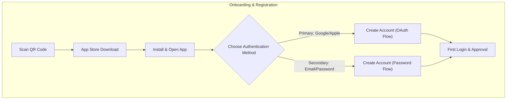
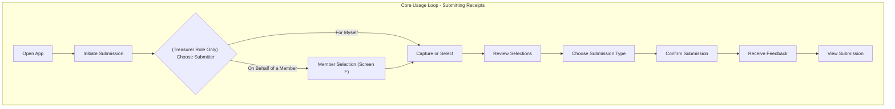

```mermaid
graph TD
    subgraph Onboarding & Registration
        A["Scan QR Code"] --> B["App Store Download"]
        B --> C["Install & Open App"]
        C --> D{"Choose Authentication Method"}
        D -- "Primary: Google/Apple" --> E1["Create Account (OAuth Flow)"]
        D -- "Secondary: Email/Password" --> E2["Create Account (Password Flow)"]
        E1 --> F["First Login & Approval"]
        E2 --> F
    end

    subgraph Core Usage Loop - Submitting Receipts
        G["Open App"] --> H["Initiate Submission"]
        H --> I{"(Treasurer Role Only) Choose Submitter"}
        I -- "For Myself" --> J["Capture or Select"]
        I -- "On Behalf of a Member" --> K["Member Selection (Screen F)"]
        K --> J
        J --> L["Review Selections"]
        L --> M["Choose Submission Type"]
        M --> N["Confirm Submission"]
        N --> O["Receive Feedback"]
        O --> P["View Submission"]
    end
```

# GoodStewards Mobile App UX and Workflow Plan

## 1. Document Purpose

This document provides a comprehensive plan for the user experience (UX), user flows, and core technical workflow for the member-facing mobile web application. Its purpose is to guide design and development, ensuring a consistent and intuitive experience for all user roles. For a broader overview of project epics, use cases, and the overall roadmap, please refer to the [Project Overview](./epics_usecases_roadmap.md) document.

## 2. Target Personas

### 2a. The Non-Profit Member

*   **Who they are:** A member of a non-profit organization who occasionally incurs expenses or makes small donations on its behalf.
*   **Core Motivation:** To contribute to their organization's mission with minimal personal friction.
*   **Key Pain Points:**
    *   Saving physical receipts is inconvenient.
    *   The process of getting reimbursed is slow and requires manual effort (e.g., in-person meetings).
    *   They often don't bother submitting small receipts, which results in lost data and unclaimed tax refunds for their organization.
*   **Primary Goals:**
    *   A fast, simple "fire-and-forget" way to submit a receipt the moment they get it.
    *   To be reimbursed quickly and electronically.

### 2b. The Non-Profit Treasurer

*   **Who they are:** The financial administrator for the non-profit. They are responsible for collecting all receipts, ensuring compliance, and filing for tax refunds.
*   **Core Motivation:** To maximize the organization's tax refund by capturing every eligible expense, while minimizing the administrative burden on themselves and members.
*   **Key Pain Points:**
    *   Receiving stacks of physical receipts from members who are not tech-savvy or don't want to use an app.
    *   Manually entering data from dozens or hundreds of receipts is tedious and error-prone.
    *   Keeping track of which receipt belongs to which member for reimbursement purposes.
*   **Primary Goals:**
    *   A way to quickly digitize and submit receipts they receive physically from members, directly from their mobile device.
    *   To easily attribute a submission to the correct member.
    *   To reduce their own data entry workload.

## 3. End-to-End User Journey

The user journey is split into two distinct phases: a one-time onboarding process and the recurring core usage loop.

### Phase 1: Onboarding & Registration (First-Time Use)

This phase allows a prospective member to join an organization. The primary, recommended method is via a secure, single-tap social sign-on (OAuth2), with a traditional email/password option available as a secondary choice.

1.  **Scan QR Code:** The user scans a unique QR code provided by the organization.
2.  **App Store Download:** The QR code directs the user to the appropriate app store to download the GoodStewards mobile app.
3.  **Install & Open App:** The user installs and opens the app, which is pre-configured with the organization's name from the QR code.
4.  **Choose Authentication Method:** The user is presented with a clear choice:
    *   **Primary (Recommended):** "Continue with Google" or "Continue with Apple."
    *   **Secondary:** A smaller option to sign up using their email and a password.
5.  **Create Account:**
    *   **OAuth Flow:** The user authenticates with their chosen provider (Google/Apple). The app receives their name and email, creating the account automatically.
    *   **Password Flow:** The user manually enters their full name, email, and creates a password.
6.  **First Login & Approval:** Upon successful registration, the user is logged in. Their membership status may be `pending` until approved by an organization administrator. They land on the main Dashboard.

### Phase 2: Core Usage Loop (Submitting Receipts)

This is the primary workflow for an authenticated, registered user. The design philosophy is **"Capture and Go."**

1.  **Open App:** The user opens the mobile web app. If their session is active, they land on the Dashboard. If not, they are presented with the Login screen.
2.  **Initiate Submission:** From the Dashboard, the user taps the primary "Add Receipts" button.
3.  **(Treasurer Role Only) Choose Submitter:** If the user has the "Treasurer" role, a modal appears asking who the submission is for.
    *   Option A: "For Myself"
    *   Option B: "On Behalf of a Member"
    *   If they choose "For Myself," the flow continues to step 4.
    *   If they choose "On Behalf of a Member," they are taken to the Member Selection screen (Screen F) before proceeding.
4.  **Capture or Select:** The user is given two clear choices: take new photos with their device camera or select one or more existing receipt images from their photo library.
5.  **Review Selections:** The user is shown thumbnails of all selected receipts, with details like total and sales tax for each. This allows them to spot and remove any accidental selections.
6.  **Choose Submission Type:** Before submitting, the user will be presented with a clear choice: "Reimburse" or "Donate".
7.  **Confirm Submission:** After selecting the submission type, the user reviews a summary of the total expenses and sales tax for all receipts to be redeemed. They then tap a single "Submit" button to confirm. The app immediately begins submitting the images in the background.
8.  **Receive Feedback:** The app provides immediate visual feedback that the submissions are processing. The user can safely navigate away or close the app; the process will continue.
9.  **View Submission:** The new submissions appear at the top of their Dashboard list with a "Pending" status, confirming the action was successful and closing the loop.





## 4. Screen-by-Screen Breakdown & Mockups



## 4. Screen-by-Screen Breakdown & Mockups

### Screen A: Login / Registration Screen
*   **Purpose:** To provide a single, clear entry point for both new and returning users, prioritizing modern, secure authentication.
*   **Key Elements:** Prominent "Continue with Google" and "Continue with Apple" buttons. A secondary, less emphasized option allows users to sign in or create an account with an email and password.
*   **Dynamic Behavior:** If the user chooses the email/password route, the screen could dynamically show a password field for existing users or name/password fields for new users after they type their email.

```ascii
+--------------------------------------+
|      Join [Organization Name]        |
|         or sign in                   |
+--------------------------------------+
|                                      |
|  [    G  Continue with Google      ] |
|                                      |
|  [      Continue with Apple      ] |
|                                      |
|  ---------------- or ---------------  |
|                                      |
|  Email Address                       |
|  [                             ]     |
|                                      |
|  [           Continue            ]   |
|                                      |
|  ----------------------------------  |
|  New user? Scan your organization's  |
|  QR code to get started.             |
+--------------------------------------+
```

### Screen C: The Dashboard (Home Screen)
*   **Purpose:** To provide the user with a clear history of their submissions and an obvious entry point for adding new receipts.
*   **Key Elements:** A vertically scrolling list of recent submissions with their status (Pending, Approved, Paid, Rejected), total, and sales tax, and a Floating Action Button (FAB) to add new ones.

```ascii
+-------------------------------------------------+
| Your Submissions                       [Avatar] |
+-------------------------------------------------+
|                                                 |
|  [Img]  Staples                       [Pending] |
|         Total: $45.21  Tax: $3.21               |
|  ---------------------------------------------  |
|  [Img]  Home Depot                     [Paid]   |
|         Total: $112.89 Tax: $8.89               |
|  ---------------------------------------------  |
|  [Img]  Processing...                 [Pending] |
|         Total: $---.-- Tax: $--.--              |
|                                                 |
|                                           [ + ] |
+-------------------------------------------------+
```

### Screen D: Review & Submit Screen
*   **Purpose:** To act as a final confirmation step, allowing the user to review their selected images, the extracted totals, and mark the submission as a donation before committing.
*   **Key Elements:** A grid of image thumbnails with totals, a summary of the combined total and sales tax, a checkbox to mark as a donation, a remove icon (X) on each, an "Add More" button, and a primary "Submit" button that dynamically counts the selections.

```ascii
+-------------------------------------------------+
| < Back      Review and Submit                   |
+-------------------------------------------------+
|                                                 |
|  +-----------+ X   +-----------+ X              |
|  | Receipt 1 |      | Receipt 2 |               |
|  | Total: $25 |     | Total: $50 |              |
|  | Tax: $2    |     | Tax: $4    |              |
|  +-----------+     +-----------+                |
|                                                 |
|  +-----------+ X                                |
|  | Receipt 3 |                                  |
|  | Total: $10 |                                 |
|  | Tax: $1    |                                 |
|  +-----------+                                  |
|                                                 |
|  ---------------------------------------------  |
|  Total: $85.00                                  |
|  Sales Tax: $7.00                               |
|                                                 |
|  [ ] Mark as donation (no reimbursement)        |
|  ---------------------------------------------  |
+-------------------------------------------------+
|  [      + Add More       ]                      |
|  [    Submit 3 Receipts    ]                    |
+-------------------------------------------------+
```

### Screen E: Submitting State Screen
*   **Purpose:** To provide clear, immediate feedback that the system has received the user's action and is processing it. This builds user trust.
*   **Key Elements:** The same layout as the Review screen, but with progress indicators (e.g., spinners) on each thumbnail and disabled action buttons to prevent duplicate submissions. A helper text reassures the user they can navigate away.

```ascii
+-------------------------------------------------+
|             Submitting...                       |
+-------------------------------------------------+
|                                                 |
|  +-----------+     +-----------+                |
|  | [Spinner] |     |     ✓     | (once done)    |
|  +-----------+     +-----------+                |
|                                                 |
|  Feel free to close this screen. We'll notify   |
|  you when your receipts are processed.          |
+-------------------------------------------------+
|  [      + Add More       ] (disabled)           |
|  [    Submitting...       ] (disabled)          |
+-------------------------------------------------+
```

### Screen F: Member Selection (Treasurer Role)
*   **Purpose:** To allow a treasurer to easily select the member or special user for whom they are submitting receipts.
*   **Key Elements:** A prominent search bar with type-ahead functionality, a list of matching members, and options for special user types ("Anonymous Donor", "Unknown User"), and a button to create a new non-member donor.
*   **Dynamic Behavior:** As the treasurer types in the search bar, the list below filters in real-time. Tapping a member's name selects them and proceeds to the receipt capture screen.

```ascii
+--------------------------------------+
| < Back      On Behalf Of...          |
+--------------------------------------+
|                                      |
|  Search Member Name                  |
|  [ John Doe...                 ]     |
|                                      |
|  ----------------------------------  |
|  Johnathan Doe                       |
|  ----------------------------------  |
|  Johnny Appleseed                    |
|  ----------------------------------  |
|                                      |
|  [  Anonymous Donor (for donations) ] |
|  [  Unknown User (for old receipts) ] |
|                                      |
|  ----------------------------------  |
|  [    + Create New Non-Member    ]   |
|  [    + Import Members (CSV)     ]   |
+--------------------------------------+
```

### Screen G: Feedback Submission
*   **Purpose:** To provide a simple and accessible way for users to submit feedback, bug reports, or feature requests. 
*   **Key Elements:** A dropdown or radio buttons for feedback type (Testimony, Bug Report, Feature Request), a multi-line text area for the message, and a submit button. Optionally, for bug reports, a checkbox to include system information.

```ascii
+--------------------------------------+
| < Back      Submit Feedback          |
+--------------------------------------+
|                                      |
|  Feedback Type:                      |
|  [ Testimony v ]                     |
|                                      |
|  Your Message:                       |
|  [                                ]  |
|  [                                ]  |
|  [                                ]  |
|  [                                ]  |
|                                      |
|  [ ] Include system info (for bugs)  |
|                                      |
|  [         Submit Feedback        ]  |
+--------------------------------------+
```

## 5. Core Technical Workflow: Receipt Submission

This describes the step-by-step process that occurs when a user hits the "Submit" button.

1.  **User Action:** User taps the "Submit [N] Receipts" button.
2.  **Frontend:** The mobile web app initiates parallel HTTPS POST requests for each selected image file to a secure backend API endpoint (e.g., `/api/receipts`). The request header includes the user's JWT authentication token. If the user is a treasurer submitting on behalf of another member, the `member_id` of that member is included in the request body.
3.  **Backend - Initial Ingestion & Validation:**
    *   The API server receives the image files.
    *   It validates the authentication token to identify the user and their associated organization. It checks if the user has the "Treasurer" role if a `member_id` is present.
    *   For each image, it immediately creates a new record in the receipts table in PostgreSQL with a status of `processing`, linking it to `organization_id` and the correct `user_id` (either the treasurer's or the selected member's).
    *   It securely streams the image file to the designated bucket in Cloudflare R2 object storage. The unique storage path (e.g., `org_id/user_id/receipt_uuid.jpg`) is saved to the new database record.
4.  **Backend - Asynchronous AI Processing:**
    *   The backend adds a job to a background queue (e.g., Celery, RQ) for each new receipt ID. This ensures the API can respond quickly to the user without waiting for AI processing.
    *   A worker process picks up the job, retrieves the image URL from the database record.
    *   The worker calls the BAML runtime, which executes a pre-defined function to call Google's Gemini Pro API, sending the image for analysis.
5.  **Backend - Data Persistence:**
    *   The Gemini API returns a structured JSON object containing the extracted vendor, date, total_amount, sales_tax, etc.
    *   The worker process receives this JSON.
    *   It updates the corresponding record in the PostgreSQL receipts table with the extracted data and changes the status from `processing` to `pending` (awaiting treasurer approval).
6.  **Frontend - UI Update:** The member's dashboard, upon being loaded or refreshed, will fetch the latest status for their submissions. For a more advanced experience, a WebSocket connection could push the status update (`processing` → `pending`) to the client in real-time.

## 6. Core Technical Workflow: Feedback Submission

This describes the step-by-step process for feedback submission.

1.  **User Action:** User taps the "Submit Feedback" button.
2.  **Frontend:** The mobile web app or web dashboard sends an HTTPS POST request to a secure backend API endpoint (e.g., `/api/feedback`). The request body includes the feedback type, message, and optionally, system information.
3.  **Backend - Ingestion & Persistence:**
    *   The API server receives the feedback data.
    *   It validates the user's authentication token.
    *   It creates a new record in a dedicated `feedback` table in PostgreSQL, storing the feedback type, message, user ID, and any captured system information.
    *   It sends an email notification to the designated support inbox (e.g., `support@goodstewards.app`) with the feedback details.
4.  **Frontend - Confirmation:** The app displays a confirmation message to the user, thanking them for their feedback.
