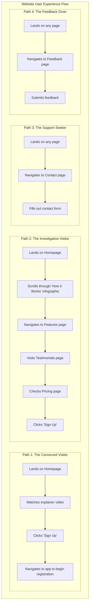

# Website Design & Development Plan: GoodStewards.app

This document outlines the plan for the public-facing MVP website for GoodStewards.app.

## 1. Introduction & Goal

*   **Primary Goal:** To serve as the main public-facing marketing and information hub for GoodStewards.app.
*   **Objective:** Convert visitors into registered users by clearly communicating the value proposition, building trust, and demonstrating the return on investment (ROI).
*   **Domain:** `goodstewards.app` (to be purchased and registered).

## 2. Target Audience

*   **Primary:** Treasurers of small to medium-sized non-profit organizations in North Carolina. They are often volunteers, are time-poor, and may not be accounting professionals.
*   **Secondary:** Executive directors, board members, and other staff involved in financial management who approve software purchases.

## 3. Key Pages & Features (MVP)

*   **Homepage (`/`)**: The main landing page to capture attention and direct users.
*   **Features (`/features`)**: A detailed explanation of how the app works.
*   **Pricing (`/pricing`)**: Clear, simple pricing tiers.
*   **Testimonials (`/testimonials`)**: Social proof from early adopters to build credibility.
*   **About Us (`/about`)**: The story and mission behind GoodStewards.
*   **Contact (`/contact`)**: A simple way for potential customers to get in touch.
*   **Feedback (`/feedback`)**: A dedicated page for users to submit testimonies, bug reports, or feature requests.
*   **Global Elements**:
    *   **Header**: Logo, navigation links, "Sign In" and "Sign Up" buttons.
    *   **Footer**: Contact info, privacy policy, terms of service, social media links, feedback link.
    *   **Call-to-Action (CTA)**: Prominent "Get Started for Free" or "Sign Up" buttons on every page.

## 4. User Experience (UX) Flow

The website journey should be simple and guide the user towards conversion with minimal friction.

*   **Path 1 (The Convinced Visitor):**
    1.  Lands on **Homepage**.
    2.  Watches the explainer video.
    3.  Clicks "Sign Up".
    4.  Navigates to the app to begin registration.

*   **Path 2 (The Investigative Visitor):**
    1.  Lands on **Homepage**.
    2.  Scrolls through the "How it Works" infographic.
    3.  Navigates to the **Features** page for more detail.
    4.  Visits the **Testimonials** page to see what others are saying.
    5.  Checks the **Pricing** page.
    6.  Clicks "Sign Up".

*   **Path 3 (The Support Seeker):**
    1.  Lands on any page.
    2.  Navigates to the **Contact** page via the header or footer.
    3.  Fills out the contact form.

*   **Path 4 (The Feedback Giver):**
    1.  Lands on any page.
    2.  Navigates to the **Feedback** page via the header or footer.
    3.  Submits feedback.



## 5. Page Mockups & Content Strategy

### Homepage (`/`)

```
+----------------------------------------------------------------------+
| Header: [Logo] [Features] [Pricing] [Testimonials] [Sign In] [Sign Up] |
+----------------------------------------------------------------------+
|                                                                      |
|  [Short Explainer Video - 60 seconds]                                |
|                                                                      |
|  Headline: Stop Leaving Money on the Table. Automate Your            |
|            Non-Profit's Sales Tax Refunds.                           |
|  Sub-headline: GoodStewards.app turns receipts into revenue,         |
|                saving you time and maximizing your mission's impact. |
|                                                                      |
|  [CTA Button: Get Started for Free]                                  |
|                                                                      |
+----------------------------------------------------------------------+
|                                                                      |
|  How It Works (Infographic Style)                                    |
|                                                                      |
|  [Icon 1]           [Icon 2]                [Icon 3]                 |
|  1. Snap & Send     2. We Extract &         3. You Approve &         |
|     Easily upload      Organize                Submit                 |
|     receipts.        Our AI captures         We generate the          |
|                      every detail.           official forms.          |
|                                                                      |
+----------------------------------------------------------------------+
|                                                                      |
|  "GoodStewards saved us over 40 hours this year. It's a              |
|   game-changer." - Jane Doe, Treasurer, ABC Charity                  |
|                                                                      |
|  [Logo Cloud of featured non-profits or partners]                    |
|                                                                      |
+----------------------------------------------------------------------+
| Footer: [About] [Contact] [Privacy Policy] [Terms] [Social Links] [Feedback] |
+----------------------------------------------------------------------+
```

### Features Page (`/features`)

*   **Section 1: AI-Powered Receipt Scanning** 
    *   Content: Detail the accuracy of the OCR, the types of receipts handled, and the security of the data.
    *   Visual: A side-by-side of a crumpled receipt and the clean, extracted data in the app.
*   **Section 2: Automated Form Generation (E-585/E-536R)**
    *   Content: Emphasize compliance, accuracy, and the time saved compared to manual form filling.
    *   Visual: An animation showing data flowing into a PDF form.
*   **Section 3: Treasurer's Dashboard**
    *   Content: Explain the simple approval/rejection workflow and the ability to track refund status.
    *   Visual: A clean mockup/screenshot of the web dashboard.

### Pricing Page (`/pricing`)

*   Keep it simple and transparent.
*   **Tier 1: Free**
    *   "For small organizations getting started."
    *   Features: Up to 50 receipts/year, 1 user.
    *   Price: $0
*   **Tier 2: Pro**
    *   "For growing non-profits."
    *   Features: Unlimited receipts, 5 users, priority support, QuickBooks integration (future).
    *   Price: $29/month (with an annual discount).

### Feedback Page (`/feedback`)

*   **Purpose:** To provide a dedicated channel for users to submit various types of feedback.
*   **Key Elements:** A form with fields for feedback type (Testimony, Bug Report, Feature Request), a text area for the message, and a submit button.

```ascii
+----------------------------------------------------------------------+
| Header: [Logo] [Features] [Pricing] [Testimonials] [Sign In] [Sign Up] |
+----------------------------------------------------------------------+
|                                                                      |
|  <h2>Submit Your Feedback</h2>                                       |
|                                                                      |
|  <p>We value your input! Please let us know your thoughts,           |
|     report any issues, or suggest new features.</p>                  |
|                                                                      |
|  Feedback Type:                                                      |
|  [ ] Testimony [ ] Bug Report [ ] Feature Request                    |
|                                                                      |
|  Your Message:                                                       |
|  [                                                                ] |
|  [                                                                ] |
|  [                                                                ] |
|                                                                      |
|  [         Submit Feedback        ]                                  |
|                                                                      |
+----------------------------------------------------------------------+
| Footer: [About] [Contact] [Privacy Policy] [Terms] [Social Links] [Feedback] |
+----------------------------------------------------------------------+
```

## 6. Technical Stack

*   **Framework:** SvelteKit (to align with the web dashboard).
*   **Styling:** Tailwind CSS for rapid, utility-first styling.
*   **Hosting:** Vercel for easy deployment, CI/CD, and a generous free tier.
