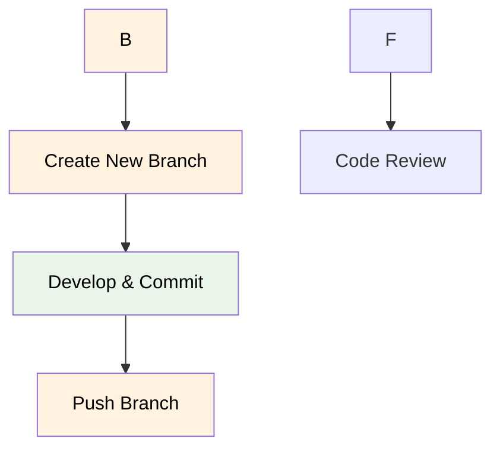

```mermaid
graph TD
    B --> C["Create New Branch"]
    C --> D["Develop & Commit"]
    D --> E["Push Branch"]
    F --> G["Code Review"]

    style D fill:#e8f5e8,color:#000000
    style E fill:#fff3e0,color:#000000
    style B fill:#fff3e0,color:#000000
    style C fill:#fff3e0,color:#000000
```